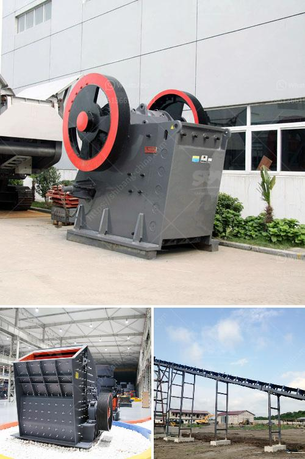

<h3>how to start a sand mining business in south africa</h3>
Starting a sand mining business in South Africa is a lucrative entrepreneurial opportunity that can provide good returns for savvy investors. However, embarking on this venture comes with its fair share of challenges and various legal requirements.

Before you start mining for sand in South Africa, you will need to obtain several governmental permits, licenses, and authorizations. Firstly, you must apply for the necessary mining permits through the Department of Mineral Resources (DMR). This includes acquiring a mining right, environmental authorization, and mining work program. The DMR will assess your application and evaluate the potential environmental impact of your proposed mining activities.

To ensure compliance with environmental regulations, it is crucial to conduct an Environmental Impact Assessment (EIA) before commencing any mining operations. This assessment evaluates the potential impacts on the environment, ecology, and nearby communities, and proposes mitigating measures to minimize negative outcomes. Engaging the services of an experienced environmental consultant is highly recommended during this process.

Additionally, it is important to establish good relationships with local authorities and communities. Consult with the local municipality to understand their regulations and requirements, and ensure you have their support for your venture. Building trust and communicating openly with the community will help to mitigate potential conflicts and ensure a smooth operation.

Equipment and infrastructure are critical aspects of a sand mining business. You will need to invest in excavators, loaders, crushers, conveyors, and trucks to facilitate the extraction, transportation, and processing of sand. It is advisable to explore partnership opportunities with suppliers or seek financing options to reduce the financial burden of purchasing equipment outright.

Once your mining operation is established, focus on marketing and developing a customer base. Identify potential buyers such as construction companies, concrete producers, landscaping businesses, and local municipalities. Develop a network and establish contracts to secure a consistent demand for your sand.

While sand mining can be a profitable venture, it is also essential to operate responsibly and sustainably. Sand mining should always be conducted in alignment with local regulations and best practices to prevent adverse environmental impacts. Engage with experts and organizations in the field to stay up to date with industry trends and advocacy for sustainable sand mining.

Finally, as with any business endeavor, it is crucial to have a robust business plan that outlines your goals, strategies, and financial projections. Conduct thorough market research to evaluate the potential profitability of sand mining in your target area. Identify opportunities and assess risks to make informed decisions.

In conclusion, starting a sand mining business in South Africa involves thorough planning, obtaining the necessary permissions, and investing in equipment and infrastructure. It is crucial to respect environmental regulations and build positive relationships with local stakeholders. With proper planning and execution, a sand mining business can provide significant returns in South Africa's construction and infrastructure sector.
<h3>Contact us</h3><ul><li><strong>Whatsapp:&nbsp;<a href="https://wa.me/8613661969651">+8613661969651</a></strong></li><li><a href="https://swt.shibang-china.com/?git&amp;zhl&amp;how to start a sand mining business in south africa"><strong>Online Service(chat now)</strong></a></li></ul><h3>Related</h3><ul><li><a href='turkey quarry crusher machines manufacturer.md'>turkey quarry crusher machines manufacturer</a></li><li><a href='jaw crusher shaft parts diagram.md'>jaw crusher shaft parts diagram</a></li><li><a href='vertical ball mill with price.md'>vertical ball mill with price</a></li><li><a href='iron ore beneficiation plant cost.md'>iron ore beneficiation plant cost</a></li><li><a href='largest crusher manufacturing company.md'>largest crusher manufacturing company</a></li></ul>