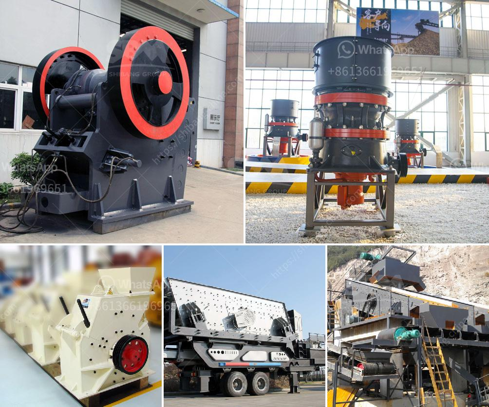

<h3>hp ball mill motors</h3>
HP ball mill motors are designed to power large industrial processes, such as mining, chemical production, and energy conversion. They are characterized by their robust construction, high efficiency, and reliable operation, which make them suitable for heavy-duty applications.

One notable feature of HP ball mill motors is their ability to generate high torque even at low speeds. This is essential for the initial starting of the mill, as well as for overcoming the inertia of the rotating drum. The motors are equipped with a direct start system, allowing for a smooth and controlled acceleration of the mill.

Furthermore, HP ball mill motors are designed to handle high loads and withstand harsh operating conditions. The motors are housed in a rugged enclosure that protects them from dust, moisture, and other contaminants. Their cooling system is optimized to dissipate the heat generated during operation, ensuring a long lifespan and reducing maintenance requirements.

The efficiency of HP ball mill motors is achieved through advanced design techniques and high-quality materials. The motors are constructed using premium-grade copper wire for improved conductivity and reduced electrical losses. Additionally, they feature precision-crafted rotor and stator laminations, which minimize energy losses due to magnetic hysteresis and eddy currents.

Moreover, HP ball mill motors are equipped with advanced motor control technology. This enables precise speed and torque control, ensuring optimal performance and energy efficiency. The motors can be integrated with a range of automation systems, allowing for remote monitoring and control to optimize the milling process.

In conclusion, HP ball mill motors are essential components for large-scale industrial processes. Their robust construction, high torque capabilities, and advanced control technology make them ideal for powering heavy-duty ball mills. The motors deliver reliable performance, high efficiency, and long-lasting operation, ensuring the smooth operation of critical processes in various industries.
<h3>Contact us</h3><ul><li><strong>Whatsapp:&nbsp;<a href="https://wa.me/8613661969651">+8613661969651</a></strong></li><li><a href="https://swt.shibang-china.com/?git&amp;zhl&amp;hp ball mill motors"><strong>Online Service(chat now)</strong></a></li></ul><h3>Related</h3><ul><li><a href='stone crusher for sales in south philippines.md'>stone crusher for sales in south philippines</a></li><li><a href='gold processing leaching plant.md'>gold processing leaching plant</a></li><li><a href='differences with gyratory crusher cone crusher.md'>differences with gyratory crusher cone crusher</a></li><li><a href='calcium powder machine.md'>calcium powder machine</a></li><li><a href='ball mill machine india.md'>ball mill machine india</a></li></ul>