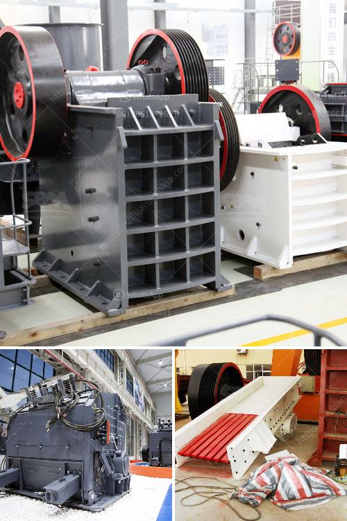

<h3>hydraulics in vertical ball mill</h3>
Hydraulic systems are widely used in many industrial applications, especially in vertical ball mills. These machines consist of a large rotating drum that contains grinding media, such as balls, pebbles, or rods. The material to be ground is fed into the drum through a hopper and crushed by the grinding media, which then moves upwards due to centrifugal force and falls back onto the material, thus reducing its size. This continuous process requires a reliable and efficient hydraulic system to ensure smooth operation and optimal performance.

One of the primary functions of the hydraulic system in a vertical ball mill is to lift the grinding media to a certain height, allowing them to cascade and grind the material. This mechanism is achieved by using hydraulic cylinders or accumulators to exert pressure on the grinding media. When the desired height is reached, the hydraulic control system releases the pressure, allowing the grinding media to fall back down and continue the grinding process. This process is repeated continuously, ensuring a consistent and efficient grinding operation.

The hydraulic system in a vertical ball mill also plays a crucial role in maintaining the stability and alignment of the mill components. It consists of several hydraulic cylinders or motors that engage with the mill's housing and support structure. These cylinders help to counteract the forces and vibrations generated during operation, preventing excessive wear and tear on the mill components. The hydraulic system also ensures that the mill remains level and aligned, promoting uniform grinding and preventing any damage to the mill or its surrounding structure.

Furthermore, the hydraulic system in a vertical ball mill enables quick and easy maintenance. By using hydraulic cylinders or motors, the mill's housing can be opened and closed, allowing access to the internal components for inspection, cleaning, or repair. This eliminates the need for complex and time-consuming disassembly procedures often associated with traditional mechanical systems. The hydraulic system also facilitates the replacement of worn or damaged grinding media, maximizing the mill's lifespan and minimizing downtime.

In conclusion, the hydraulic system in a vertical ball mill is an essential component that allows for smooth operation, optimal performance, and easy maintenance. Its primary functions include lifting the grinding media, maintaining stability and alignment, and facilitating quick maintenance procedures. By utilizing hydraulic cylinders or motors, the mill can operate efficiently and reliably, ensuring the consistent production of fine materials. As technology continues to advance, hydraulic systems in vertical ball mills are likely to become even more sophisticated and integrated, further enhancing their efficiency and effectiveness in various industrial applications.
<h3>Contact us</h3><ul><li><strong>Whatsapp:&nbsp;<a href="https://wa.me/8613661969651">+8613661969651</a></strong></li><li><a href="https://swt.shibang-china.com/?git&amp;zhl&amp;hydraulics in vertical ball mill"><strong>Online Service(chat now)</strong></a></li></ul><h3>Related</h3><ul><li><a href='belt conveyor continental di indonesia.md'>belt conveyor continental di indonesia</a></li><li><a href='mini stone jaw crushers.md'>mini stone jaw crushers</a></li><li><a href='mobile aggregate plant for sale in the philippines.md'>mobile aggregate plant for sale in the philippines</a></li><li><a href='trommel ball mill.md'>trommel ball mill</a></li><li><a href='jaw crusher south africa used.md'>jaw crusher south africa used</a></li></ul>