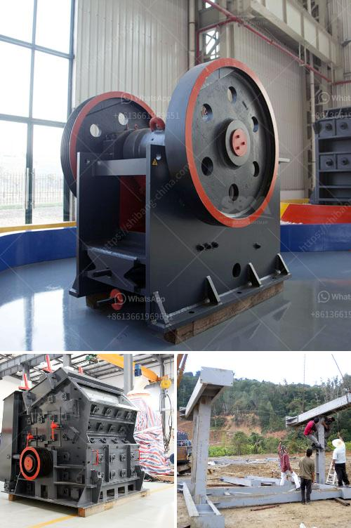

<h3>hydroton pebbles clay manufacturing process</h3>
Hydroton pebbles, also known as expanded clay pebbles, are commonly used in hydroponic gardening systems as a growing medium. With their lightweight and porous qualities, hydroton pebbles provide excellent support for plant roots while also allowing for proper aeration and drainage. In this article, we will explore the manufacturing process of hydroton pebbles clay.

The manufacturing process of hydroton pebbles clay begins with the extraction of clay from natural deposits. Clay, a type of soil formed from the decomposition of rocks, can be found in various locations around the world. Once the clay has been extracted, it is transported to a processing facility.

At the processing facility, the clay undergoes several stages to transform it into hydroton pebbles. The first step is to remove impurities and foreign materials from the clay. This is done by passing it through a series of screens and filters to separate larger rocks and debris.

Next, the clay is finely crushed and milled into a powder-like consistency. This helps to break down the clay into smaller particles, making it easier to work with during the manufacturing process. The finely crushed clay is then mixed with water to form a moldable paste.

Once the clay paste is ready, it goes through a shaping process. There are two common methods used to shape hydroton pebbles: pelletizing and sintering. In the pelletizing method, the clay paste is forced through a machine that extrudes it into small cylindrical shapes. These shapes are then cut into small pieces, creating the pebbles. In the sintering method, the clay paste is molded into small balls, which are then heated to high temperatures in a kiln. This process causes the clay particles to expand and become porous, resulting in the characteristic lightweight and porous hydroton pebbles.

After the shaping process, the hydroton pebbles are dried to remove any moisture from the clay. This is typically done in industrial dryers or through natural sun drying methods. Once the pebbles are dry, they are screened and sorted based on size and density. This ensures that the pebbles are of a consistent shape and size, allowing for uniformity in hydroponic gardening systems.

The final step in the manufacturing process is packaging and distribution. The hydroton pebbles are packaged in bags or containers, ready for use by hydroponic gardeners around the world. They are typically sold in various sizes to accommodate different gardening setups.

In conclusion, the manufacturing process of hydroton pebbles clay involves the extraction of clay from natural deposits, removal of impurities, crushing and milling into a powder, shaping through pelletizing or sintering, drying, and sorting. This process results in lightweight, porous pebbles that provide excellent support, aeration, and drainage for plant roots in hydroponic gardening systems. The popularity of hydroton pebbles can be attributed to their numerous benefits in growing plants without soil, making them a valuable component in modern agriculture.
<h3>Contact us</h3><ul><li><strong>Whatsapp:&nbsp;<a href="https://wa.me/8613661969651">+8613661969651</a></strong></li><li><a href="https://swt.shibang-china.com/?git&amp;zhl&amp;hydroton pebbles clay manufacturing process"><strong>Online Service(chat now)</strong></a></li></ul><h3>Related</h3><ul><li><a href='which roller stand in milling industry.md'>which roller stand in milling industry</a></li><li><a href='roller for plate mill manufacturer.md'>roller for plate mill manufacturer</a></li><li><a href='ball mill machine india.md'>ball mill machine india</a></li><li><a href='stone crusher for sale in zimbabwe.md'>stone crusher for sale in zimbabwe</a></li><li><a href='gold stone crusher and separator.md'>gold stone crusher and separator</a></li></ul>