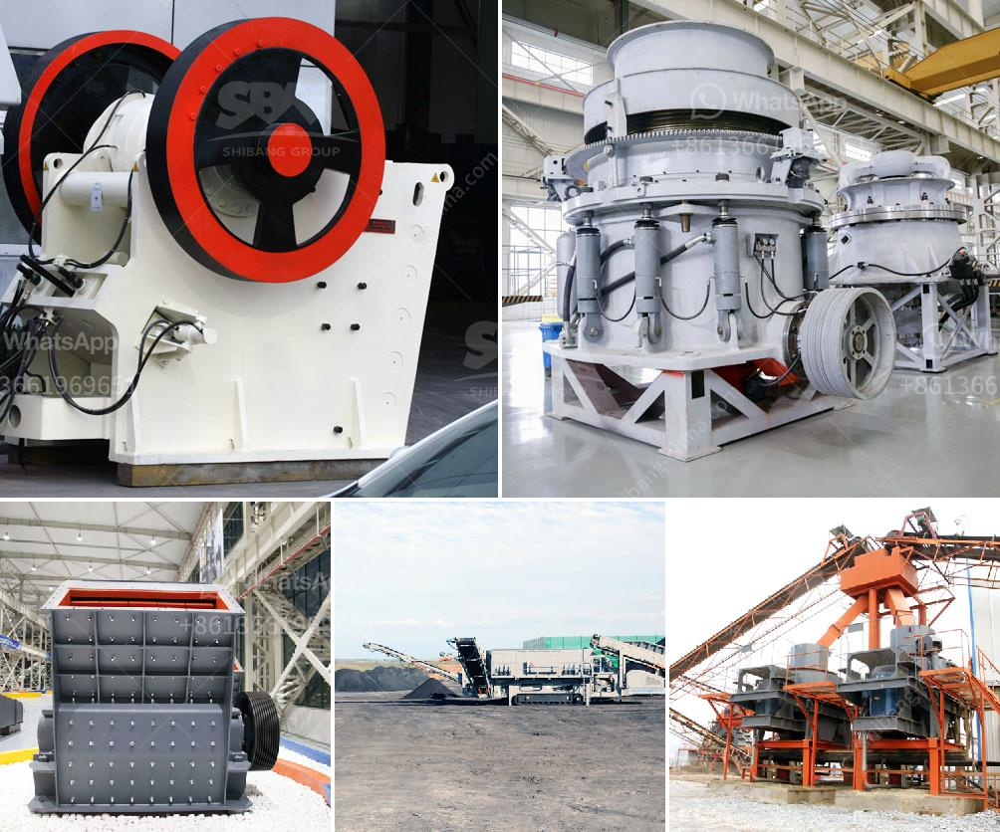

<h3>i need a second hand mobile stone crusher south africa</h3>
In recent years, the rapid development of South Africa's infrastructure construction has brought a lot of opportunities for the development of the mining industry. Nowadays, mobile stone crushers have been widely used in South Africa to process countless mined materials.

Mobile stone crushers are widely utilized in the mining industry for crushing various types of stones, such as limestone, granite, basalt, andesite, and other hard rocks. These plants are particularly suitable for crushing river gravel and construction waste materials. Mobile stone crushers have a wide range of applications, and they can be found in a variety of industries, such as mining, metallurgy, construction, roads, railways, water conservancy, and chemical industries.

For those who want to invest in the mining industry, a second-hand mobile stone crusher can meet their needs. Various models of second-hand mobile stone crushers provide great cost benefits for buyers. With low operation costs, flexible operation, and high efficiency, these machines are highly successful in mineral ore processing.

One of the most popular mobile stone crusher models in South Africa is the 300-500 range of crushers, which are specifically designed for medium-scale operations. These machines encompass a wide range of features, allowing them to handle challenging tasks with ease. They can crush rocks with a maximum feed size of up to 500mm, making them suitable for various kinds of stone materials.

When searching for a second-hand mobile stone crusher in South Africa, it is essential to choose a reliable and trustworthy equipment supplier. Look for a company that has been in the industry for many years, providing excellent service and high-quality equipment. It's also vital to check the condition of the crusher and ensure that it meets your specific requirements.

Apart from finding a reliable supplier, it's worth considering the advantages of a second-hand mobile stone crusher in South Africa. Cost-effectiveness is one of the biggest benefits, as used crushers are typically more affordable than brand-new ones. Additionally, second-hand crushers may come with additional features that can enhance productivity and ease of use.

To ensure that you make a wise investment, evaluate your specific needs before purchasing a second-hand mobile stone crusher. Consider factors such as the required production capacity, the size and type of stone to be crushed, and the availability of skilled operators for maintenance and support. Additionally, pay attention to the overall condition of the crusher, including its wear parts, engine, and hydraulic system.

In conclusion, a second-hand mobile stone crusher in South Africa is a cost-effective and reliable option for many mining investors. Choosing a quality machine that suits your specific needs is essential to ensure successful operations. By carefully evaluating your requirements and finding a trustworthy supplier, you can find an efficient and affordable mobile stone crusher to boost your mining operations.
<h3>Contact us</h3><ul><li><strong>Whatsapp:&nbsp;<a href="https://wa.me/8613661969651">+8613661969651</a></strong></li><li><a href="https://swt.shibang-china.com/?git&amp;zhl&amp;i need a second hand mobile stone crusher south africa"><strong>Online Service(chat now)</strong></a></li></ul><h3>Related</h3><ul><li><a href='quarry crusher for sale in nigeria.md'>quarry crusher for sale in nigeria</a></li><li><a href='feldspar crusher unit.md'>feldspar crusher unit</a></li><li><a href='cement plant machinery manufacturers in coimbatore.md'>cement plant machinery manufacturers in coimbatore</a></li><li><a href='gold crushing machine price in usa.md'>gold crushing machine price in usa</a></li><li><a href='cement clinker conveyor belt.md'>cement clinker conveyor belt</a></li></ul>