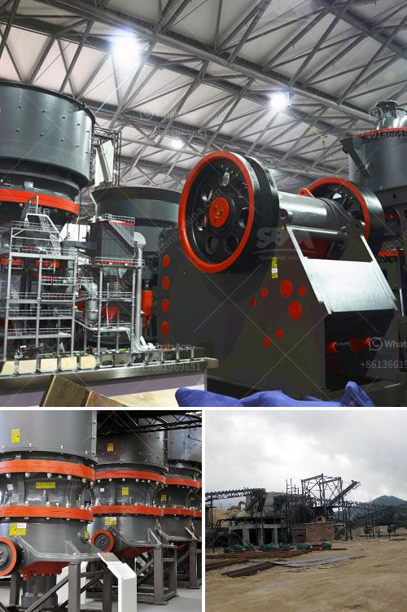

<h3>impact crusher equipment manufacturer</h3>
An impact crusher is a piece of heavy-duty equipment that is used to reduce the size of large rocks or gravel into smaller pieces. The machine utilizes a heavy metal block or a hammer, which is attached to a rotating rotor to collide with the rock and break it apart. This process is known as impact crushing.

In the construction and mining industry, impact crushers are widely used due to their efficiency in reducing large rocks and materials to smaller sizes. This equipment is highly popular among contractors and quarry owners as it provides high-performance crushing solutions for a variety of applications.

When it comes to choosing the right impact crusher equipment manufacturer, it is crucial to opt for a reputable and reliable supplier. A manufacturer that specializes in producing quality impact crushers with advanced technology and innovative designs is essential for achieving the desired results.

One of the top impact crusher equipment manufacturers in the industry is XYZ Company. With years of experience and expertise, XYZ Company has established itself as a leading supplier of impact crushers worldwide. Their equipment is known for its superior quality, durability, and reliability.

XYZ Company's impact crushers are designed to deliver maximum performance in various applications, including construction, demolition, recycling, and mining. Their machines are equipped with powerful motors, heavy-duty rotors, and advanced control systems, ensuring efficient and consistent crushing operations.

What sets XYZ Company apart from other manufacturers is their commitment to customer satisfaction. They provide exceptional after-sales support, including quick turnaround time for spare parts and technical assistance. This ensures that customers can maximize the uptime of their impact crushers, minimizing any disruptions to their operations.

In conclusion, choosing the right impact crusher equipment manufacturer is crucial for achieving efficient and reliable crushing solutions. XYZ Company's reputation and experience in producing high-quality impact crushers make them a top choice for contractors and quarry owners seeking a dependable and durable crushing equipment. With XYZ Company, customers can be confident in the performance and durability of their impact crushers, enabling them to enhance productivity and profitability in their operations.
<h3>Contact us</h3><ul><li><strong>Whatsapp:&nbsp;<a href="https://wa.me/8613661969651">+8613661969651</a></strong></li><li><a href="https://swt.shibang-china.com/?git&amp;zhl&amp;impact crusher equipment manufacturer"><strong>Online Service(chat now)</strong></a></li></ul><h3>Related</h3><ul><li><a href='copper ore mining for sale in philippines.md'>copper ore mining for sale in philippines</a></li><li><a href='beneficiation process of clay.md'>beneficiation process of clay</a></li><li><a href='grinding calcium carbonate equipment.md'>grinding calcium carbonate equipment</a></li><li><a href='price of jaw crusher germany.md'>price of jaw crusher germany</a></li><li><a href='gypsum mining plant.md'>gypsum mining plant</a></li></ul>