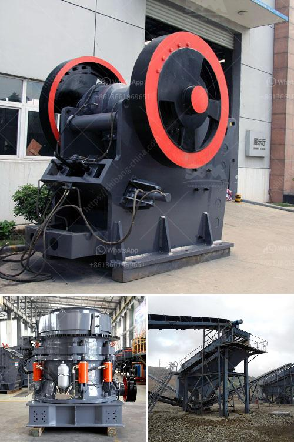

<h3>impact crusher for sale philippines</h3>
The Philippines is known for its rich mineral resources, with reserves of gold, copper, nickel, and many other minerals. Along with these reserves, there is a huge demand for aggregates in the country due to the booming construction industry. To meet this demand, various types of crushing equipment are used, and one of the most commonly used types is the impact crusher.

An impact crusher, also known as a hammer crusher, is a versatile and efficient machine that utilizes impact force to crush and reduce materials into smaller sizes. Its primary purpose is to provide high-quality aggregate for construction projects. However, due to its ability to crush a variety of materials including concrete, asphalt, and limestone, it is also used in recycling applications.

One of the main advantages of an impact crusher is its ease of maintenance. Unlike other types of crushers, such as jaw crushers or cone crushers, which require constant lubrication and frequent cleaning, an impact crusher can be cleaned and maintained easily. It also has fewer wear parts, which means lower maintenance costs and less downtime.

In the Philippines, several companies offer impact crushers for sale to the public. These machines can be used in various industries such as mining, construction, and recycling. They are commonly used to crush large rocks and ores into smaller pieces and are capable of handling materials with a feed size of up to 500mm.

Impact crushers for sale in the Philippines come in different configurations, each with unique features and applications. The impact crusher has an adjustable impact and crushing zone, allowing it to break rocks of different sizes. It also has a high reduction ratio, resulting in efficient crushing performance.

When considering purchasing an impact crusher for sale in the Philippines, it is important to choose a reliable brand and supplier. Look for a reputable company with a proven track record in providing high-quality crushers and excellent after-sales service. It is also advisable to research and compare different models to determine which one best suits your specific needs.

Apart from the quality and reliability of the impact crusher, another factor to consider is the price. Prices can vary depending on the brand, model, and additional features of the machine. However, it is important to strike a balance between cost and quality. Cheaper options may not offer the same level of durability and performance, while overly expensive models may exceed your budget.

In conclusion, an impact crusher is a valuable asset for any construction or mining project in the Philippines. Its ability to crush a wide range of materials makes it a versatile and efficient machine. When purchasing an impact crusher, it is important to choose a reliable brand and supplier, and to consider factors such as quality, price, and after-sales service. Whether it is for a large-scale construction project or a small-scale recycling operation, an impact crusher is a worthwhile investment for any company in the Philippines.
<h3>Contact us</h3><ul><li><strong>Whatsapp:&nbsp;<a href="https://wa.me/8613661969651">+8613661969651</a></strong></li><li><a href="https://swt.shibang-china.com/?git&amp;zhl&amp;impact crusher for sale philippines"><strong>Online Service(chat now)</strong></a></li></ul><h3>Related</h3><ul><li><a href='stone crusher machine price in south africa.md'>stone crusher machine price in south africa</a></li><li><a href='gypsum crusher plant pdf.md'>gypsum crusher plant pdf</a></li><li><a href='total gypsum mill production in india.md'>total gypsum mill production in india</a></li><li><a href='how much does a jaw crusher cost.md'>how much does a jaw crusher cost</a></li><li><a href='crusher in china.md'>crusher in china</a></li></ul>