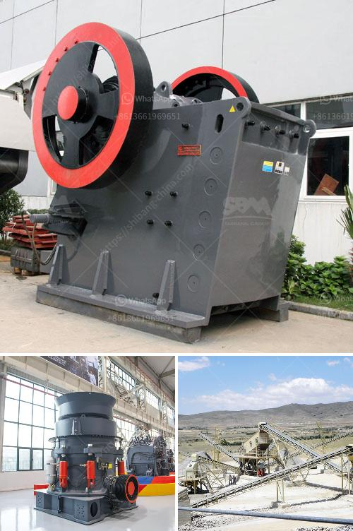

<h3>impact crusher pioneer chassis mounted</h3>
The impact crusher pioneer chassis mounted is known for its robust design and high performance. This chassis-mounted machine is designed to be easily transported and quickly set up on any job site. With a capacity range of 100-300 TPH, the impact crusher pioneer chassis mounted is the perfect choice for contractors who want to efficiently crush materials on the fly.

One of the standout features of the impact crusher pioneer chassis mounted is its ability to handle various types of materials, including limestone, granite, and concrete. This makes it a versatile machine that can be used in a wide range of applications, from road construction to mining operations.

The machine's durable construction ensures that it can withstand the rigors of daily use in demanding environments. It is equipped with heavy-duty components, including a robust frame, a large feed opening, and high-quality wear parts. These features enable the machine to deliver consistent and reliable performance, even when processing tough materials.

The impact crusher pioneer chassis mounted also offers excellent fuel efficiency, thanks to its hydraulic drive system. This system allows the machine to automatically adjust the crusher settings to optimize fuel consumption while still delivering high production rates. This makes it an environmentally friendly choice for contractors looking to reduce their carbon footprint.

Another notable feature of the impact crusher pioneer chassis mounted is its user-friendly design. The machine is equipped with intuitive controls and a clear display panel, making it easy for operators to monitor and adjust the crusher settings. Additionally, the machine's accessibility features, such as walkways and handrails, ensure safe and efficient maintenance operations.

In conclusion, the impact crusher pioneer chassis mounted is a robust and versatile machine that offers high performance and excellent fuel efficiency. Its durable construction, user-friendly design, and ability to handle various types of materials make it a reliable choice for contractors in the construction and mining industries. Whether used in road construction or mining operations, this machine is sure to deliver exceptional results.
<h3>Contact us</h3><ul><li><strong>Whatsapp:&nbsp;<a href="https://wa.me/8613661969651">+8613661969651</a></strong></li><li><a href="https://swt.shibang-china.com/?git&amp;zhl&amp;impact crusher pioneer chassis mounted"><strong>Online Service(chat now)</strong></a></li></ul><h3>Related</h3><ul><li><a href='portable diamond processing plant supplier.md'>portable diamond processing plant supplier</a></li><li><a href='coal mining machines for sale.md'>coal mining machines for sale</a></li><li><a href='small scale copper refining equipment.md'>small scale copper refining equipment</a></li><li><a href='chrome mining business plan crusher.md'>chrome mining business plan crusher</a></li><li><a href='stone crusher machine in south africa.md'>stone crusher machine in south africa</a></li></ul>