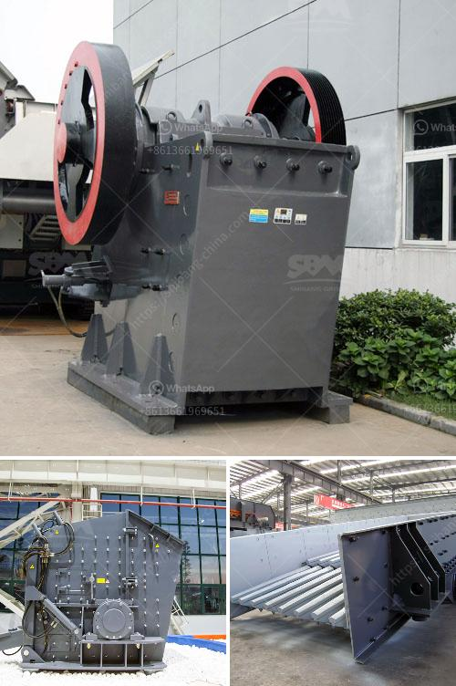

<h3>impact crusher plant manufacturer</h3>
When choosing an impact crusher plant manufacturer, customers should consider multiple factors, including certification, reliability of the equipment, and after-sales support. With years of experience and a dedicated team of professionals, ABC Crusher Plants has emerged as a leading manufacturer in the industry, providing top-quality crushing solutions to customers worldwide.

Certification is an important factor to consider when selecting an impact crusher plant manufacturer. ABC Crusher Plants is ISO 9001:2015 certified, ensuring that their manufacturing processes and equipment meet international standards of quality and efficiency. This certification guarantees that their products are reliable, durable, and safe to use. Furthermore, ABC Crusher Plants’ commitment to quality is reflected in the strict quality control measures they employ during the manufacturing process.

Reliability of the equipment is another crucial aspect that customers must consider. ABC Crusher Plants uses high-quality materials and components to ensure the durability and long lifespan of their impact crusher plants. Their machines are designed to withstand heavy-duty applications, delivering consistent performance and high productivity.

In addition to manufacturing exceptional equipment, ABC Crusher Plants also provides unparalleled after-sales support. Their team of experts is readily available to assist customers with any technical issues or inquiries they may have. Whether it is installation, maintenance, or troubleshooting, ABC Crusher Plants is committed to ensuring customer satisfaction.

One of the primary advantages of choosing ABC Crusher Plants as your impact crusher plant manufacturer is their extensive range of products. They offer a wide variety of models and configurations to suit different crushing requirements. From small-scale projects to large-scale operations, ABC Crusher Plants provides customized solutions to meet the unique needs of their customers.

In conclusion, ABC Crusher Plants is a reputable impact crusher plant manufacturer that provides reliable crushing solutions. With their ISO certification, high-quality equipment, and exceptional after-sales support, customers can trust ABC Crusher Plants to deliver efficient and durable crushing solutions. Whether it is for mining, quarrying, construction, or recycling, ABC Crusher Plants has the expertise and capabilities to meet your crushing needs.
<h3>Contact us</h3><ul><li><strong>Whatsapp:&nbsp;<a href="https://wa.me/8613661969651">+8613661969651</a></strong></li><li><a href="https://swt.shibang-china.com/?git&amp;zhl&amp;impact crusher plant manufacturer"><strong>Online Service(chat now)</strong></a></li></ul><h3>Related</h3><ul><li><a href='aggregate screening plants.md'>aggregate screening plants</a></li><li><a href='quarry crusher for sale in nigeria.md'>quarry crusher for sale in nigeria</a></li><li><a href='grinding calcium carbonate equipment.md'>grinding calcium carbonate equipment</a></li><li><a href='quartz powder ball mill in tamilnadu.md'>quartz powder ball mill in tamilnadu</a></li><li><a href='sand and gravel crusher machine for sale philippines.md'>sand and gravel crusher machine for sale philippines</a></li></ul>