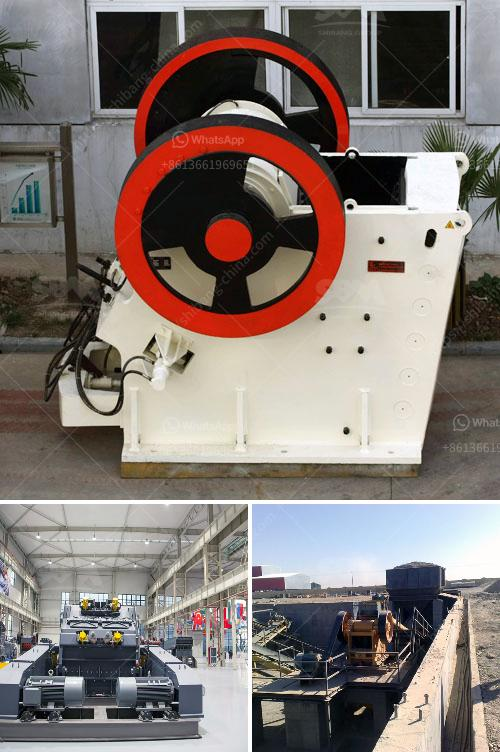

<h3>impact crusher turkey</h3>
Turkey is known for its rich mineral resources, which have been exploited intensely in the last few decades. This has resulted in fierce competition in the mining industry, with many companies vying for the top spot. One equipment that has played a vital role in this race is the impact crusher. With its efficient crushing mechanism, rugged construction, and low maintenance requirements, the impact crusher has become a popular choice among mining operators in Turkey.

Impact crushers are machines designed to crush rocks and ores using a high-speed impact force. This force is generated by the rotating rotor of the crusher, which strikes the material and propels it against the crushing chamber's aprons. The resultant impact breaks the material into smaller pieces, making it suitable for further processing or disposal.

Turkey's impact crusher industry has a long history of manufacturing high-quality equipment that meets international standards. Turkish manufacturers have been recognized for their ability to produce robust machines that can withstand the harshest operating conditions. This durability is particularly important in mining operations, where the equipment is constantly subjected to heavy impacts and abrasive materials.

Furthermore, Turkish impact crusher manufacturers have been quick to adopt new technologies and incorporate them into their machines. Many models feature advanced hydraulic systems, which allow for easy and precise adjustment of the crusher's output size. This, in turn, results in higher productivity, reduced downtime, and overall cost savings for the operator.

The versatility of impact crushers is another reason why they are so widely used in Turkey's mining industry. These machines can handle a wide range of materials, including soft and hard rocks, limestone, dolomite, and even concrete. Whether it is primary crushing or secondary crushing, an impact crusher can deliver the desired results efficiently.

In conclusion, the impact crusher has been a game-changer in Turkey's mining industry. Its ability to crush and process various materials, combined with its durability and low maintenance requirements, make it an invaluable tool for mining operators. As Turkey continues to develop its mineral resources, the impact crusher will continue to be a reliable partner in the crushing and mining operations across the country.
<h3>Contact us</h3><ul><li><strong>Whatsapp:&nbsp;<a href="https://wa.me/8613661969651">+8613661969651</a></strong></li><li><a href="https://swt.shibang-china.com/?git&amp;zhl&amp;impact crusher turkey"><strong>Online Service(chat now)</strong></a></li></ul><h3>Related</h3><ul><li><a href='calcite powder making.md'>calcite powder making</a></li><li><a href='ball mills for mining in china.md'>ball mills for mining in china</a></li><li><a href='aggregate roller crushing mill malaysia.md'>aggregate roller crushing mill malaysia</a></li><li><a href='micron limestone grinding unit in india.md'>micron limestone grinding unit in india</a></li><li><a href='quartz ball for ball mill.md'>quartz ball for ball mill</a></li></ul>