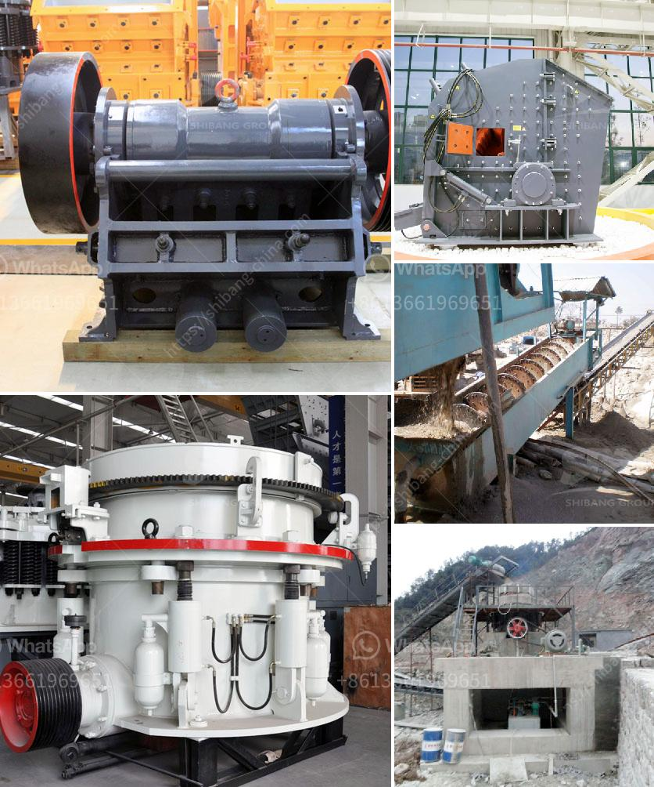

<h3>impact pulverizer model sje25</h3>
The Impact Pulverizer Model SJE25 is a technologically advanced and highly efficient machine for crushing various materials into fine powders. This pulverizer is especially suitable for processing brittle and hard materials, such as minerals, glass, chemicals, and plastics.

One of the key features of the Impact Pulverizer Model SJE25 is its unique design, which allows for a high-speed rotation of the rotor. This high-speed rotation generates a strong impact force, enabling the pulverizer to break the materials into small particles.

With a compact and user-friendly design, the Impact Pulverizer Model SJE25 is easy to operate and maintain. It is equipped with a powerful motor that ensures a consistent and reliable performance. The machine is also equipped with safety features, such as a protective cover and a safety switch, which prevent any accidents or injuries during operation.

The Impact Pulverizer Model SJE25 offers a wide range of applications in various industries. It can be used in the pharmaceutical industry for grinding medicines into fine powders, ensuring their uniformity and effectiveness. In the chemical industry, this pulverizer can be utilized for processing different chemicals and compounds, facilitating their mixing and blending.

Furthermore, the Impact Pulverizer Model SJE25 is highly efficient in the mining industry. It can be used to crush minerals and ores, reducing them to the desired particle size for further processing or extraction. This pulverizer is particularly effective in processing hard and brittle minerals, such as quartz and feldspar.

Another significant advantage of the Impact Pulverizer Model SJE25 is its energy efficiency. Its design minimizes power consumption while maximizing the output. This makes it a cost-effective and environmentally friendly option for various industries.

Moreover, the Impact Pulverizer Model SJE25 is designed to be versatile and adaptable. It offers adjustable grinding fineness, allowing users to control the particle size according to their specific requirements. This flexibility makes it suitable for a wide range of applications and materials.

In conclusion, the Impact Pulverizer Model SJE25 is a reliable machine with a range of features that make it a valuable asset in various industries. Its high-speed rotation, efficient design, and versatility make it suitable for crushing hard and brittle materials, ensuring the production of fine powders with minimal power consumption. Whether in the pharmaceutical, chemical, or mining industry, this pulverizer is a reliable solution for efficient particle size reduction.
<h3>Contact us</h3><ul><li><strong>Whatsapp:&nbsp;<a href="https://wa.me/8613661969651">+8613661969651</a></strong></li><li><a href="https://swt.shibang-china.com/?git&amp;zhl&amp;impact pulverizer model sje25"><strong>Online Service(chat now)</strong></a></li></ul><h3>Related</h3><ul><li><a href='harga pasaran stone crusher.md'>harga pasaran stone crusher</a></li><li><a href='how much does a stone crusher mill.md'>how much does a stone crusher mill</a></li><li><a href='malaysia crusher plant manufacturer and supplier.md'>malaysia crusher plant manufacturer and supplier</a></li><li><a href='rock crusher dust fog control system philippines.md'>rock crusher dust fog control system philippines</a></li><li><a href='new trends in concrete technology slide presentation.md'>new trends in concrete technology slide presentation</a></li></ul>