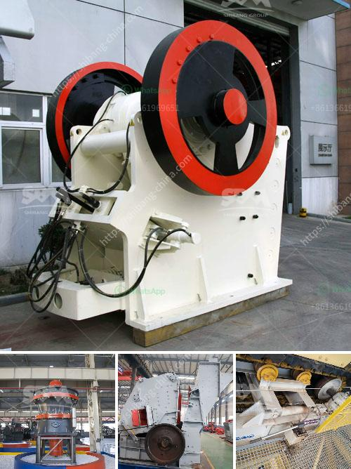

<h3>impact rock crusher</h3>
An impact rock crusher is a type of crushing machine that is utilized to crush rocks into smaller particles. In essence, it consists of a high-speed rotor and a series of impact hammers that are propelled by an electric motor. The material to be crushed is fed into the crushing chamber through a hopper and struck by the impact hammers. This process results in the fragmentation of the rocks, making them suitable for various construction purposes.

One of the primary benefits of using an impact rock crusher is its versatility. It can be used to crush a wide range of materials, including concrete, asphalt, limestone, and many others. This makes it an ideal choice for construction projects that require the use of different types of crushed rocks. Additionally, this type of crusher is designed to produce uniform and consistent particles, ensuring the quality and efficiency of the final product.

Another advantage of an impact rock crusher is its efficiency. Compared to other types of crushers, such as jaw crushers or cone crushers, an impact crusher has a higher crushing ratio and can handle more difficult materials. This means that less energy is required to crush the rocks, resulting in cost savings and reduced environmental impact. Furthermore, the adjustable impact plates on the crusher allow for precise control over the size of the output particles, making it suitable for various applications.

In conclusion, an impact rock crusher is a powerful and versatile machine that can efficiently crush different types of rocks. Its ability to produce uniform particles and its cost-effectiveness make it a valuable asset in the construction industry. Whether it is used for road construction, building foundations, or landscaping, an impact crusher is an essential tool for crushing rocks and creating the necessary materials for various construction projects.
<h3>Contact us</h3><ul><li><strong>Whatsapp:&nbsp;<a href="https://wa.me/8613661969651">+8613661969651</a></strong></li><li><a href="https://swt.shibang-china.com/?git&amp;zhl&amp;impact rock crusher"><strong>Online Service(chat now)</strong></a></li></ul><h3>Related</h3><ul><li><a href='nip guards on conveyor belts grinding.md'>nip guards on conveyor belts grinding</a></li><li><a href='portalble stone crusher.md'>portalble stone crusher</a></li><li><a href='machine supplier of stone crusher in philippines.md'>machine supplier of stone crusher in philippines</a></li><li><a href='the production process of cobblestone.md'>the production process of cobblestone</a></li><li><a href='small concrete crusher.md'>small concrete crusher</a></li></ul>