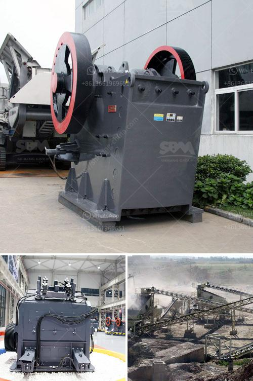

<h3>india stone crusher machine price</h3>
India stone crusher machine price is one of the main factors influencing the purchase of a stone crusher machine, along with the influence of the market, in the future, there will be an increasingly big mobilization. When the demand of stone crusher machine is increased its price is also increased. Stone crusher machine price in india is float, but SBM can offer you the advanced machine and excellent solution, while the stone crusher machine list will be reasonable.

One of the unique features of SBM stone crusher machine price in India is their ability to run on three phase power or a diesel generator, and the installation of crushing machines of high capacity and environmental protection is available. On the market, there are many crushing equipment, stone crusher is one of the equipment.

In addition to the crusher, the machine can be used to select selective fragmentation devices. The crusher has a function crushing various materials, but also provides the standard size particles required by the user, thus reducing the consumption of power thus reducing production costs. The stone crusher machine price in India is based on the model, size, type and quantity.

Different models have different output, so the model numbers and output of machines are different, and the prices are also different. For example, if the output of 50-100t / h is fixed, then the price of the crusher will increase accordingly. The price of 100-150t / h stone crusher is different with the type of product. The price of each type of crusher is different.

Different types of stone crusher machine price in india involves different types of stone crusher machines. For example, jaw crusher, impact crusher, cone crusher, VSI crusher, hammer crusher and so on. The price of the different machine are not the same, here we will analyze one by one for you.

Hammer crusher is suitable for soft ore, limestone, gypsum,etc. Hammer crusher by single hammer to crush and its efficiency compared with similar crusher is not high. Furthermore it is not suitable for medium hardness or high hardness ore crushing, because the loss will be very great. with these limitations, so its price is the lowest of all the crusher in India.

Impact crusher, with multiple crushing chamber and a plurality of the back plate, is very much into stone crushing, reaching the final finished materials. It has a rotor and stator having good impact resistance property. The back plate in turn can withstand the impact from the rotor, so that there will be no accidents of slippage. The current price of stone crushers are various business secrets, many people far disclosed.

But the price of crusher machine will always floating each year, and no manufacturer will price it in advance. So what can we do to help? Sand and stone production line includes vibrating feeder, jaw crusher, impact crusher, vibrating screen, belt conveyor and centrally electric controlling system, etc. The designed capacity is from 50t/h to 500t/h. To meet customer's specific requirement, we can also add other equipments such as cone crusher, dust catcher on the production.

Construction waste crushing production line is improved from the old hammer crusher on the basis of the combination of two hammer crusher, a reasonable combination of a whole, the appearance of construction waste grinder, practical and strong. Using the upper and lower two-stage double-rotor crushing principle.

The concrete crusher is suitable for medium or fine crushing of a variety of ores and rocks which have less than 250Mpa crushing compressive strength in metallurgical industry, mining industry, building industry, chemical industry, water conservancy and railway sectors. It has advantages such as big crushing ratio, uniform product size, low power consumption, convenient repair and maintenance, etc.

In conclusion, the mobile stone crushing plant in India has been getting more and more popular in construction, mining, and some other industries. Each year, a large number of clients purchased crushing and powder-making machineries produced by SBM. The next year, when the products of major users recollect accounting for more than 90% of the total demand, we can boldly predict that mobile stone crushing plants will continue to develop to add market share. Whether or not the price of machines running in the market could reflect the specific price trend, is topic of discussion nowadays. I will provide the advice and supply the price for you sincerely.
<h3>Contact us</h3><ul><li><strong>Whatsapp:&nbsp;<a href="https://wa.me/8613661969651">+8613661969651</a></strong></li><li><a href="https://swt.shibang-china.com/?git&amp;zhl&amp;india stone crusher machine price"><strong>Online Service(chat now)</strong></a></li></ul><h3>Related</h3><ul><li><a href='stone crusher in usa.md'>stone crusher in usa</a></li><li><a href='marble production process.md'>marble production process</a></li><li><a href='iron ore 100 150tph belt conveyor price.md'>iron ore 100 150tph belt conveyor price</a></li><li><a href='ball coal crusher industries.md'>ball coal crusher industries</a></li><li><a href='process of a granite crusher machine.md'>process of a granite crusher machine</a></li></ul>