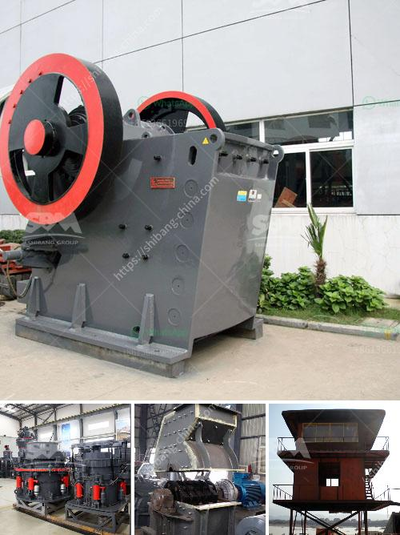

<h3>indonesia copper processing equipment for sale</h3>
Indonesia, known as the world's fourth most populous country and covering a diverse range of islands, is also one of the top copper-producing nations globally. With vast natural resources and a strategic location, Indonesia represents a promising destination for copper processing equipment sales. The country's thriving mining industry not only contributes significantly to its overall economic growth but also helps in the development of sustainable practices.

In recent years, Indonesia has witnessed a surge in copper production, making it an attractive market for companies dealing in copper processing equipment. The increasing demand for copper, combined with advancements in mining technologies, has propelled the Indonesian copper industry forward. Consequently, copper processing equipment has become crucial for the extraction and refinement of this valuable mineral.

The extraction process starts with copper ore being mined from underground or open-pit mines across the archipelago. These mines yield massive amounts of copper concentrate, which must be processed further to obtain pure copper. Here, copper processing equipment becomes indispensable. It includes various machinery and tools designed to crush, grind, and separate the copper ore to extract the desired metal efficiently.

Indonesia has seen a remarkable investment growth in the mining sector, attracting both local and international companies. As a result, the demand for copper processing equipment has risen significantly. Domestic manufacturers have also witnessed a surge in demand for their equipment, promoting local industries and creating job opportunities. This boosts the country's economy by not only generating revenue but also stimulating other related sectors.

Moreover, the availability of advanced copper processing equipment enables Indonesia to explore environmentally friendly approaches to copper mining. Sustainable practices are becoming increasingly important worldwide, and Indonesia is no exception. By adopting state-of-the-art equipment and technologies, miners can minimize the environmental impact of their operations, reducing their carbon footprint. This allows Indonesia to ensure sustainable development, balancing economic growth with ecological conservation.

Furthermore, the sales of copper processing equipment in Indonesia offer a potential for international manufacturers to establish strategic partnerships and expand their global reach. Indonesian mining companies often seek reliable suppliers and equipment manufacturers, presenting an opportunity for foreign companies to showcase their expertise and establish long-term connections. Such collaborations contribute to knowledge sharing, technology transfer, and overall industry growth.

It is worth noting that as Indonesia's copper industry continues to flourish, the demand for processing equipment is expected to rise steadily. To meet this growing demand, manufacturers need to address the specific requirements and challenges associated with the Indonesian market. Adapting equipment to local conditions, providing comprehensive after-sales support, and complying with relevant regulations can foster trust and increase market penetration.

As Indonesia's copper production continues to thrive, the need for efficient and sustainable copper processing equipment becomes imperative. By leveraging its vast natural resources, embracing innovative technologies, and promoting sustainable mining practices, Indonesia can become a global leader in the copper industry. The sale of advanced processing equipment not only contributes to the country's economic growth but also paves the way for a sustainable future focused on responsible resource management.
<h3>Contact us</h3><ul><li><strong>Whatsapp:&nbsp;<a href="https://wa.me/8613661969651">+8613661969651</a></strong></li><li><a href="https://swt.shibang-china.com/?git&amp;zhl&amp;indonesia copper processing equipment for sale"><strong>Online Service(chat now)</strong></a></li></ul><h3>Related</h3><ul><li><a href='alluvial gold mining methods in zimbabwe.md'>alluvial gold mining methods in zimbabwe</a></li><li><a href='how much is the price of a jaw crusher.md'>how much is the price of a jaw crusher</a></li><li><a href='the production process of cobblestone.md'>the production process of cobblestone</a></li><li><a href='trommel ball mill.md'>trommel ball mill</a></li><li><a href='dolomite ball mill price.md'>dolomite ball mill price</a></li></ul>