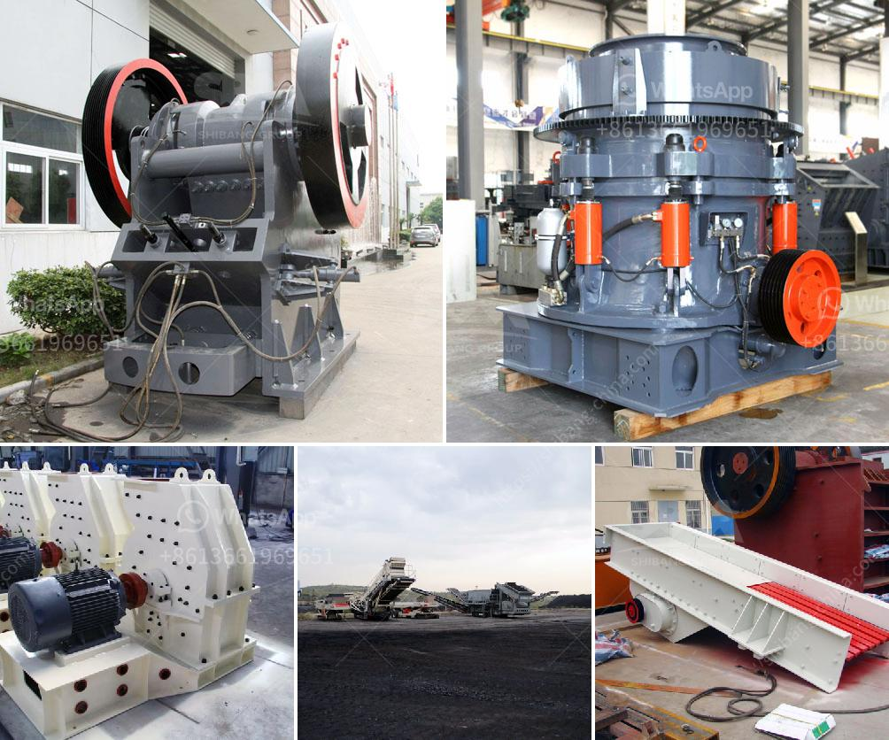

<h3>indonesia jaw crusher</h3>
Indonesia is a widely known archipelago that is rich in natural resources, such as minerals, coal, gold, limestone, and nickel. The country has witnessed a substantial growth in the mining sector over the years, which has resulted in the need for advanced mining equipment, including jaw crushers.

The jaw crusher is an indispensable piece of equipment for the mining and quarrying industry. Crushers were first introduced in 1830, and have since evolved to become a vital part of the mining industry. Jaw crushers are capable of crushing large rocks into smaller pieces, making them ideal equipment for reducing the size of raw materials.

One of the key advantages of jaw crushers is their ability to process hard and abrasive materials. They can handle various types of rocks, such as granite, basalt, limestone, and sandstone. This versatility makes them a popular choice in the mining and construction industries. Additionally, jaw crushers have a high crushing ratio, meaning that they can break down large rocks into smaller, more manageable sizes.

In Indonesia, the mining sector plays a crucial role in the country's economic development. The government has focused on attracting foreign investment to exploit the country's mineral resources effectively. With an abundance of mineral reserves, international mining companies have been keen to invest in Indonesia's mining sector. As a result, the demand for mining equipment, including jaw crushers, has been on the rise.

Indonesia jaw crushers are designed to exceed the primary crushing needs of customers in the mining, quarrying, and recycling industries. These machines are among the most advanced and reliable in the market and are highly productive in a variety of applications. A wide range of jaw crushers is available in Indonesia, catering to different mining requirements.

One popular jaw crusher model in Indonesia is the Pe Series Jaw Crusher, which is designed to crush materials with a compressive strength below 320MPa. Another commonly used jaw crusher is the PEX Series, which is used in secondary crushing process. It can crush materials with a compressive strength of up to 350MPa.

The jaw crusher market in Indonesia is expected to grow at a CAGR of around 4.7% during the forecast period, considering the macro and microeconomic factors influencing the market. The growth is driven by the increasing mining activities and the rising demand for jaw crushers in the country.

Key players in the Indonesia jaw crusher market include Sandvik, Metso, FLSmidth, Kleemann, Thyssenkrupp, Terex, Powerscreen, Striker, and NMS Industries. These companies are focused on expanding their product portfolio and enhancing their distribution networks to cater to the growing demand in Indonesia's mining sector.

To conclude, the jaw crusher is a vital piece of equipment for the mining industry in Indonesia. It is widely used in various applications due to its versatility and high crushing ratio. With the growth of Indonesia's mining sector, the demand for jaw crushers is expected to increase, unlocking the potential of this market. As the country continues to attract foreign investment, the mining industry will continue to thrive, driving the demand for advanced mining equipment like jaw crushers.
<h3>Contact us</h3><ul><li><strong>Whatsapp:&nbsp;<a href="https://wa.me/8613661969651">+8613661969651</a></strong></li><li><a href="https://swt.shibang-china.com/?git&amp;zhl&amp;indonesia jaw crusher"><strong>Online Service(chat now)</strong></a></li></ul><h3>Related</h3><ul><li><a href='portable crusher in philippines.md'>portable crusher in philippines</a></li><li><a href='carbonate crusher price per ton.md'>carbonate crusher price per ton</a></li><li><a href='conveyor systems for sand and gravel.md'>conveyor systems for sand and gravel</a></li><li><a href='grinding steel balls for mining.md'>grinding steel balls for mining</a></li><li><a href='stone crushing machine prices za.md'>stone crushing machine prices za</a></li></ul>