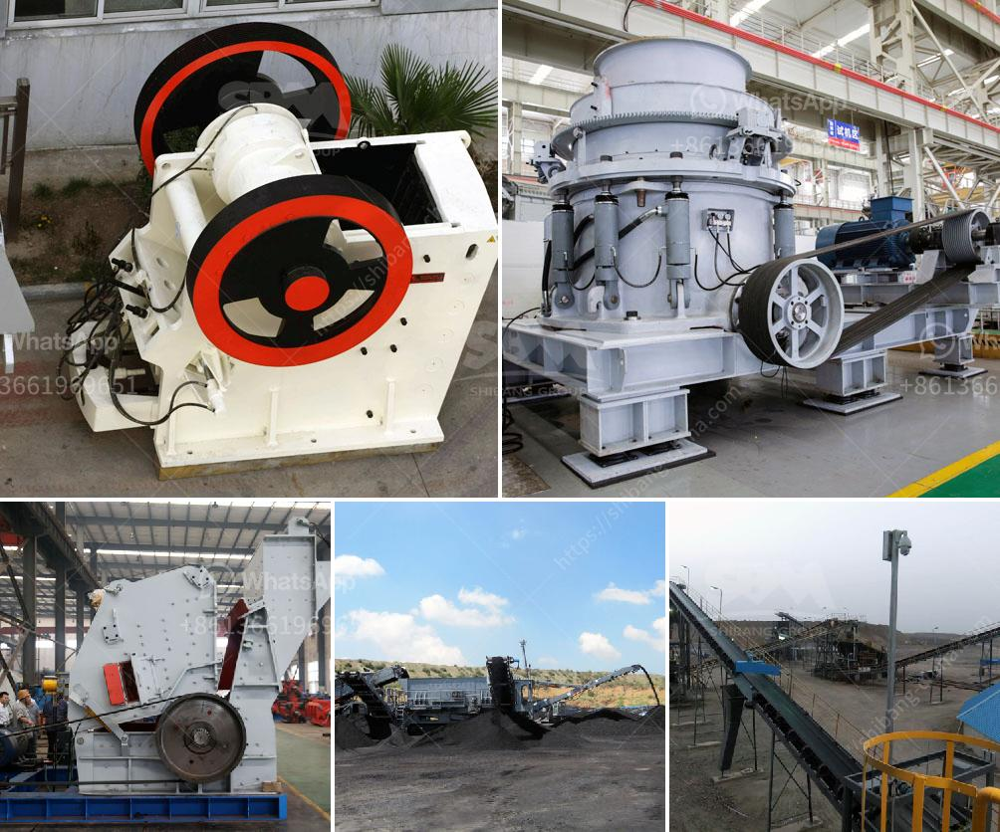

<h3>industria de la piedra caliza en m</h3>
La industria de la piedra caliza en México ha experimentado un crecimiento significativo en los últimos años. La piedra caliza se utiliza en una amplia variedad de sectores, desde la construcción hasta la agricultura, e incluso en la fabricación de vidrio.

México es uno de los principales productores de piedra caliza en todo el mundo. Las principales áreas de producción se encuentran en los estados de Veracruz, San Luis Potosí, Puebla, Hidalgo y Nuevo León. Estas regiones tienen una gran cantidad de reservas de piedra caliza de alta calidad.

La piedra caliza se utiliza principalmente en la construcción como base para carreteras y como material de construcción para edificios. Además, se utiliza en la fabricación de concreto y cemento, dos materiales esenciales en el sector de la construcción.

Otro sector importante que utiliza la piedra caliza es la agricultura. La piedra caliza se utiliza como enmienda del suelo para neutralizar la acidez y mejorar la fertilidad del mismo. Además, se utiliza en la fabricación de fertilizantes para promover el crecimiento de las plantas.

La industria de la piedra caliza en México también está relacionada con la fabricación de vidrio. La piedra caliza se utiliza como ingrediente principal en la producción de vidrio, ya que ayuda a fundir los otros componentes y a reducir la temperatura de fusión.

En conclusión, la industria de la piedra caliza en México es uno de los pilares de la economía nacional. Su uso en la construcción, agricultura y fabricación de vidrio juega un papel fundamental en el desarrollo del país y genera empleo en diversas regiones. México ha demostrado ser un importante productor de piedra caliza a nivel mundial y se espera que esta industria siga creciendo en los próximos años.
<h3>Contact us</h3><ul><li><strong>Whatsapp:&nbsp;<a href="https://wa.me/8613661969651">+8613661969651</a></strong></li><li><a href="https://swt.shibang-china.com/?git&amp;zhl&amp;industria de la piedra caliza en m"><strong>Online Service(chat now)</strong></a></li></ul><h3>Related</h3><ul><li><a href='ball india ball mills 220 tph.md'>ball india ball mills 220 tph</a></li><li><a href='china quartz sand dryer manufacturer.md'>china quartz sand dryer manufacturer</a></li><li><a href='stone grinding machine type raymond mill price.md'>stone grinding machine type raymond mill price</a></li><li><a href='rock processing plant.md'>rock processing plant</a></li><li><a href='washing plant setup cost south africa.md'>washing plant setup cost south africa</a></li></ul>