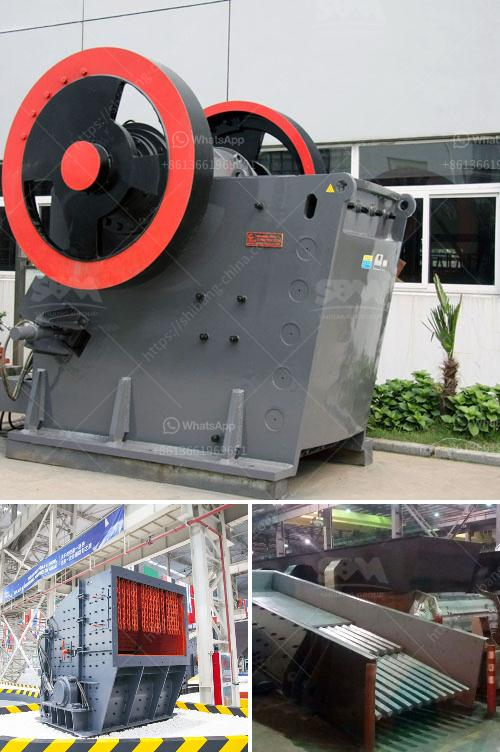

<h3>industrial application of ball mills</h3>
The ball mill is a key equipment extensively used for grinding crushed materials in production lines for powders such as cement, fertilizer, refractory material, silicates, glass ceramics as well as for ore dressing of both, black and non-ferrous metals. It is suitable for dry grinding and wet grinding, and the energy-saving ball miller is popular in industrial sectors like cement, refractory, fertilizer, and glass ceramics, etc.

The capacity of ball mills can vary significantly and it ranges from a few liters to several cubic meters. They have a high production capacity with low power consumption. Modern ball mills are suitable for both dry and wet grinding, but in the past, a significant percentage of the energy was consumed by the ball mill with the majority of energy converted into heat. As a result, cement manufacturing companies had to invest in new technologies to reduce this heat loss and optimize energy consumption.

The industrial ball mill works in a closed circuit, which means there is no need to purchase additional screens or filters to separate the desired particles from the material that needs to be crushed. It also means the power consumption of the ball mill can be significantly reduced.

In recent years, the demand for smaller and more compact grinding equipment has increased in many industries. Compact ball mills are ideal for small-scale industrial applications, such as mining operations, which require the grinding of minerals into fine particles. By using the right equipment, materials with good hardness and particles of different sizes can be created in a short amount of time.

The ball mill has a very simple design and consists of a horizontal cylinder, rotating on its axis. It is fed with raw materials and a grindable mixture is created. The grinding chamber is filled with grinding media (steel balls) of different sizes. When the cylinder rotates, the grinding media and raw materials rotate with it, creating a cascading effect, grinding the materials within the ball mill.

The ball mill is widely used in cement, silicate products, new construction materials, and other production industries. It is one of the key equipment in the cement industry, especially in the cement forging process flow. It has a wide range of applications, such as raw material preparation, clinker grinding, and cement grinding.

In the mining industry, the ball mill is widely used for grinding various ores and other materials. It plays a vital role in both open-circuit and closed-circuit grinding circuits. It is commonly used in the grinding of cement, silicate products, new building materials, refractory materials, fertilizers, black and non-ferrous metal dressings, and glass ceramics, dry or wet grinding of various ores and other grindable materials.

In conclusion, the ball mill is a highly efficient piece of industrial equipment that can grind materials into fine particles quickly and reduce energy consumption. The ball mill has a wide range of applications in cement, mining, and other industries and is suited to process a variety of materials. With advances in technology, industrial ball mills are becoming more versatile and efficient, contributing to the overall success of various industries.
<h3>Contact us</h3><ul><li><strong>Whatsapp:&nbsp;<a href="https://wa.me/8613661969651">+8613661969651</a></strong></li><li><a href="https://swt.shibang-china.com/?git&amp;zhl&amp;industrial application of ball mills"><strong>Online Service(chat now)</strong></a></li></ul><h3>Related</h3><ul><li><a href='roll mills supplier in karachi.md'>roll mills supplier in karachi</a></li><li><a href='hammer mills for mining.md'>hammer mills for mining</a></li><li><a href='marble crusher machine.md'>marble crusher machine</a></li><li><a href='mini stone jaw crushers.md'>mini stone jaw crushers</a></li><li><a href='vibrating screen manufacturing process.md'>vibrating screen manufacturing process</a></li></ul>