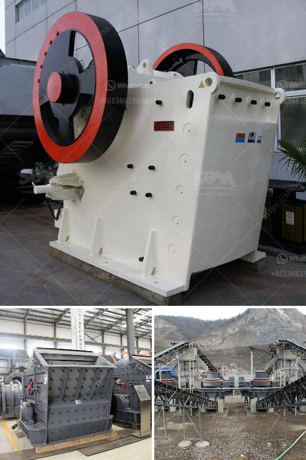

<h3>industrial impact crusher</h3>
The industrial impact crusher is a versatile machine that efficiently and effectively reduces size and volume of a wide range of materials. In a multitude of industries, this equipment is widely used due to its ability to quickly and easily reduce even the hardest materials into smaller particles.

One of the key features of an industrial impact crusher is its ability to break down materials quickly and efficiently. This is achieved by the impact of the massive rotors, which are typically driven by a high horsepower motor. As the rotor spins at high speeds, it hits the material, causing it to break and reduce in size. The result is a product that can be easily handled, transported, and processed further.

The industrial impact crusher is commonly used for crushing medium-hardness materials such as limestone, clinker, coal, calcium carbide, quartz, dolomite, iron pyrites, gypsum, and chemical raw materials. With high crushing ratio, the impact crusher can effectively reduce the particle size of the materials, which helps to improve the industrial production efficiency.

Another advantage of the industrial impact crusher is its ability to produce a cubical-shaped material. Unlike other crushing equipment, such as jaw crushers, cone crushers, and hammer crushers, which crush the material through compression or squeezing, the impact crusher breaks the material using the principle of impact. This results in a more uniform and cubical-shaped product, which is highly desirable for many applications.

Additionally, the industrial impact crusher is equipped with advanced technology, such as hydraulic systems, which allows for greater control and adjustment of the machine. This enables operators to optimize the crushing process for specific materials and desired final product sizes. Furthermore, the impact crusher can be easily integrated into existing production lines, making it a cost-effective solution for industrial processes.

In terms of maintenance, the industrial impact crusher is designed to be robust and durable. The wear parts, such as the blow bars and impact plates, are made of high-quality manganese steel, which ensures long-lasting performance and reduced downtime. Moreover, the crusher is equipped with a hydraulic opening mechanism, which facilitates quick and easy access to the interior of the machine for maintenance and replacement of parts.

In conclusion, the industrial impact crusher is a powerful machine that can efficiently crush a wide range of materials. Its ability to break down materials quickly and produce a cubical-shaped product makes it a preferred choice in many industries. Whether it is used for mining, construction, or recycling applications, the impact crusher offers high performance, durability, and versatility. With continuous advancements in technology, the industrial impact crusher is expected to further improve and remain an essential tool in various industrial processes.
<h3>Contact us</h3><ul><li><strong>Whatsapp:&nbsp;<a href="https://wa.me/8613661969651">+8613661969651</a></strong></li><li><a href="https://swt.shibang-china.com/?git&amp;zhl&amp;industrial impact crusher"><strong>Online Service(chat now)</strong></a></li></ul><h3>Related</h3><ul><li><a href='crushers for sale saudi arabia.md'>crushers for sale saudi arabia</a></li><li><a href='dry ball mill for silica powder.md'>dry ball mill for silica powder</a></li><li><a href='ball milling equipment and milling media.md'>ball milling equipment and milling media</a></li><li><a href='calcium carbonate grinding mill price.md'>calcium carbonate grinding mill price</a></li><li><a href='cement making machines for factory.md'>cement making machines for factory</a></li></ul>