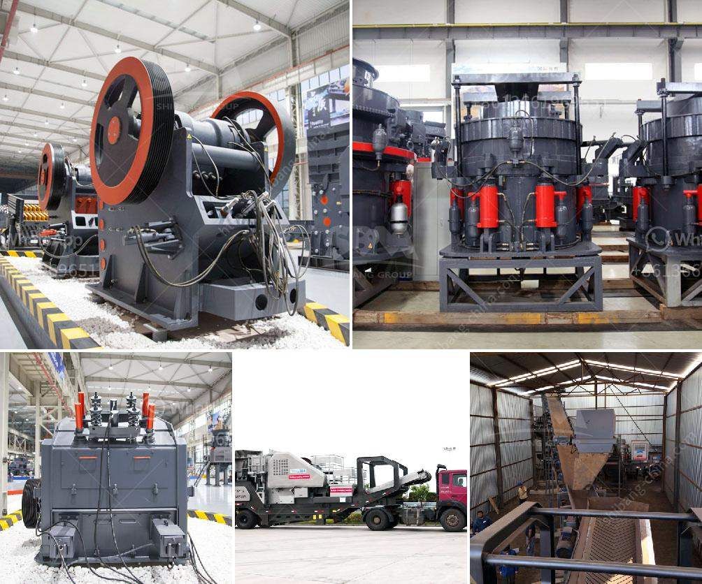

<h3>industrial impact crushers</h3>
Industrial impact crushers are widely used in various industries such as mining, construction, and recycling. They are used to reduce the size of large rocks, ore, or waste materials into smaller sizes for easier handling and disposal. These machines use impact force to crush the material, which makes them highly efficient and versatile.

One of the key features of industrial impact crushers is their ability to produce a consistent cubical shape in the final product. This is achieved through the use of a horizontal shaft impactor, which uses a high-speed rotor to strike the material and generate a strong impact force. The impact force breaks the material into smaller pieces, ensuring a uniform shape and size distribution.

In addition to producing a consistent shape, industrial impact crushers also offer high reduction ratios. This means that they can effectively reduce the size of large rocks or ore into smaller pieces, allowing for more efficient processing. This is particularly important in industries such as mining, where the size of the material needs to be reduced before it can be transported and processed further.

Another advantage of industrial impact crushers is their versatility. These machines can handle a wide range of materials, including hard rocks, soft rocks, and even recycled materials. This makes them suitable for various applications, such as crushing limestone for road construction, crushing concrete for recycling, or crushing ores for mineral extraction.

Industrial impact crushers are also known for their durability and reliability. They are designed to withstand heavy-duty use in demanding environments, such as mines and construction sites. The robust construction and high-quality materials used in these machines ensure that they can withstand continuous operation, minimizing downtime and maintenance costs.

Furthermore, industrial impact crushers are designed with safety in mind. They are equipped with safety features such as overload protection and a hydraulic system that prevents damage to the crusher in case of an excessive load. This ensures that the machine operates safely and efficiently, protecting both the operator and the equipment.

In conclusion, industrial impact crushers play a crucial role in various industries by reducing the size of large rocks, ore, or waste materials. They offer several advantages such as producing a consistent cubical shape, high reduction ratios, versatility, durability, and safety. These machines are an essential tool for mining, construction, and recycling industries, allowing for more efficient processing and handling of materials. With ongoing advancements in technology, industrial impact crushers continue to evolve, providing even greater efficiency and productivity.
<h3>Contact us</h3><ul><li><strong>Whatsapp:&nbsp;<a href="https://wa.me/8613661969651">+8613661969651</a></strong></li><li><a href="https://swt.shibang-china.com/?git&amp;zhl&amp;industrial impact crushers"><strong>Online Service(chat now)</strong></a></li></ul><h3>Related</h3><ul><li><a href='limestone crusher cost.md'>limestone crusher cost</a></li><li><a href='diesel engine hammer mill crusher.md'>diesel engine hammer mill crusher</a></li><li><a href='production grinding mill europe.md'>production grinding mill europe</a></li><li><a href='aggregate quarry plant.md'>aggregate quarry plant</a></li><li><a href='aggregates crashing plant in nigeria.md'>aggregates crashing plant in nigeria</a></li></ul>