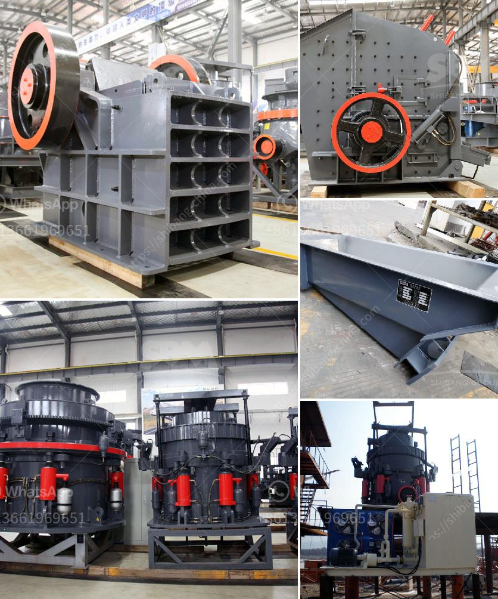

<h3>industrial uses of white marble powder</h3>
White marble powder is a versatile and highly sought-after industrial material that has found its way into a wide range of applications across various industries. Derived from natural marble stone, this fine powder is primarily composed of calcium carbonate and has unique properties that make it an ideal choice for a myriad of uses.

One of the most prominent industrial uses of white marble powder is in the production of paints and coatings. Due to its high brightness and ability to reflect light, it acts as an exceptional pigment extender, enhancing color intensity and giving the final product a smooth and glossy finish. The fine particles of the powder allow for a uniform distribution in paint formulations, resulting in excellent coverage and improved durability. Additionally, its chemical stability ensures that the paint does not fade or lose its vibrancy over time. Moreover, with its neutral pH level, white marble powder is compatible with a wide range of paint formulations, making it a preferred choice for manufacturers.

The construction industry is another major consumer of white marble powder. Due to its ability to enhance the properties of cement-based materials, it is widely used as a filler and extender in construction materials such as concrete, mortar, and grout. The powder improves the workability of these materials, making them easier to mix, pump, and place. Its fine particle size contributes to the overall density and strength of the final product, increasing its load-bearing capacity. The addition of white marble powder also enhances the resistance of cement-based materials against chemical attacks, ensuring their longevity and structural integrity. Additionally, the powder helps in reducing the shrinkage and cracking tendencies of concrete, thus improving its durability.

Moreover, white marble powder finds extensive use in the manufacturing of ceramics. When added to ceramic bodies, it acts as a fluxing agent, reducing the firing temperature and enabling better sintering of the materials. This leads to increased strength and improved densification of the ceramic products. The powder also enhances the whiteness and brightness of ceramic glazes, making them more visually appealing. Furthermore, its smooth texture eliminates imperfections on the surface of ceramic tiles, resulting in a polished and glossy finish.

Another notable application of white marble powder is in the production of paper and cardboard. As a mineral filler, it improves the opacity, brightness, and printability of the paper. It enhances the bulkiness and stiffness of the paper, making it suitable for various printing and packaging applications. The powder's high whiteness also contributes to the aesthetic appeal of the paper product.

In conclusion, white marble powder has emerged as a versatile and valuable industrial material with numerous applications across various industries. Its unique properties, including high brightness, chemical stability, and fine particle size, make it a preferred choice for industries such as paints and coatings, construction, ceramics, and paper production. With its ability to enhance the properties of various materials, the demand for white marble powder continues to grow, contributing to the advancement of these industries.
<h3>Contact us</h3><ul><li><strong>Whatsapp:&nbsp;<a href="https://wa.me/8613661969651">+8613661969651</a></strong></li><li><a href="https://swt.shibang-china.com/?git&amp;zhl&amp;industrial uses of white marble powder"><strong>Online Service(chat now)</strong></a></li></ul><h3>Related</h3><ul><li><a href='rock crusher production line.md'>rock crusher production line</a></li><li><a href='mtm grinding mill.md'>mtm grinding mill</a></li><li><a href='graphite processing machine.md'>graphite processing machine</a></li><li><a href='mobile chrome wash plant for sale.md'>mobile chrome wash plant for sale</a></li><li><a href='components for cone crusher major.md'>components for cone crusher major</a></li></ul>