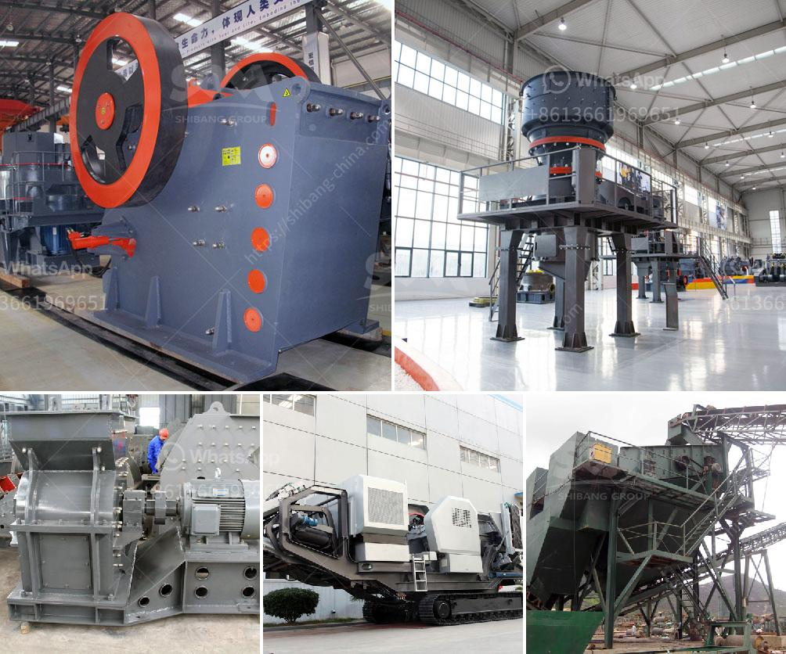

<h3>iron ore 100 150tph belt conveyor price</h3>
Iron ore has become one of the most important commodities in the global market, with its demand consistently on the rise. As a result, the need for efficient transportation systems to move large quantities of iron ore has become paramount. One such transportation solution is the belt conveyor, which offers numerous advantages over other methods.

When it comes to belt conveyors designed specifically for iron ore, a 100-150tph capacity is considered ideal. This capacity allows for the transportation of a significant amount of iron ore in a relatively short period of time, making it suitable for large-scale mining operations. Additionally, the conveyor's belt width and speed can be adjusted to meet specific requirements, ensuring optimal efficiency.

In terms of pricing, a 100-150tph belt conveyor for iron ore typically falls within a competitive price range. Prices can vary depending on factors such as the manufacturer, the conveyor's specifications, and additional features. However, it is important to note that investing in a high-quality belt conveyor can yield long-term benefits and reduce maintenance and replacement costs.

Several factors contribute to the price of a belt conveyor for iron ore. The quality and durability of the materials used, the complexity of the conveyor's design, and the level of automation incorporated all play a role in determining the final price. Additionally, factors such as after-sales service, warranty, and installation support should be considered when evaluating different price options.

It is recommended to compare prices and features from multiple suppliers to ensure a fair market price. Additionally, seeking expert advice and conducting thorough research on the reputation and reliability of the manufacturer is crucial before making a purchase.

In conclusion, a 100-150tph belt conveyor for iron ore offers an efficient and reliable transportation solution for the mining industry. While the price may vary depending on various factors, investing in a high-quality conveyor can provide long-term benefits and enhance overall operational efficiency.
<h3>Contact us</h3><ul><li><strong>Whatsapp:&nbsp;<a href="https://wa.me/8613661969651">+8613661969651</a></strong></li><li><a href="https://swt.shibang-china.com/?git&amp;zhl&amp;iron ore 100 150tph belt conveyor price"><strong>Online Service(chat now)</strong></a></li></ul><h3>Related</h3><ul><li><a href='stone crusher to buy in bangalore.md'>stone crusher to buy in bangalore</a></li><li><a href='south africa ballast crushing companies.md'>south africa ballast crushing companies</a></li><li><a href='stone crushing equipment zenith.md'>stone crushing equipment zenith</a></li><li><a href='portalble stone crusher.md'>portalble stone crusher</a></li><li><a href='quarry equipment leasing companies in nigeria.md'>quarry equipment leasing companies in nigeria</a></li></ul>