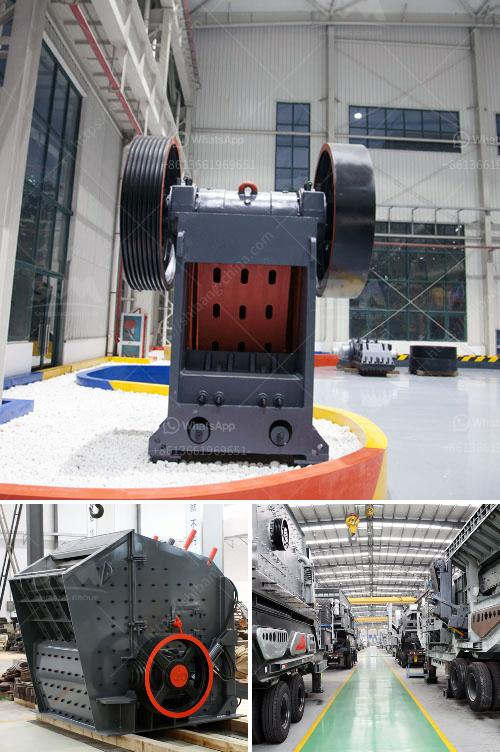

<h3>iron ore beneficiation plant for sale</h3>
Iron ore beneficiation plant refers to a production line that processes and separates iron ore from other minerals or materials. The extracted iron ore is processed into various high-quality iron ores of different specifications, which are sold in the iron ore market and can be used in steel-making industry.

The iron ore beneficiation plant comprises a scrubber, a spiral classifier, a high-gradient magnetic separator (HGMS), a VSI crusher (vertical shaft impact crusher), a ball mill, a dryer, a grading conveyor, a vibrating screen, a mixing tank, a jig concentrator, a pre-concentration magnetic separator, and other equipment. These machines work together to complete the iron ore beneficiation process.

The scrubber is used to remove impurities from the iron ore particles and improve the iron ore grade. It is a cylindrical drum with internal blades that rotates to scrub the ore particles against each other. By doing so, the impurities adhering to the ore surfaces are rubbed off and detached, resulting in cleaner and purer iron ore.

The spiral classifier is designed to separate the slurry containing iron ore particles of different sizes into different grades. It utilizes the principle of sedimentation to make the heavy particles settle down to the bottom and the light particles stay on top, thus achieving effective separation.

The HGMS is a key equipment in the iron ore beneficiation plant. It utilizes the magnetic force between the ore particles and the magnetic matrix to separate the magnetic and non-magnetic fractions. This process is particularly effective in the separation of iron ore fines and magnetic minerals, such as hematite and magnetite.

The VSI crusher is used to crush the raw iron ore into smaller particles of appropriate size for further grinding in the ball mill. It can reduce the iron ore to sizes less than 1 mm and thus increase the efficiency of subsequent grinding.

The ball mill is a key equipment in the iron ore beneficiation plant. It grinds the crushed iron ore into fine powder, which is then processed further in the magnetic separator.

The dryer removes moisture from the iron ore particles, making it easier to handle and transport. It also helps to improve the iron ore grade by eliminating impurities caused by moisture.

The grading conveyor and vibrating screen are used to separate the iron ore particles according to their sizes. This ensures that the iron ore products meet the customers' specific requirements and specifications.

The mixing tank is used to mix the iron ore slurry with chemicals and reagents, such as flotation agents, to facilitate the beneficiation process.

The jig concentrator and pre-concentration magnetic separator are used to further concentrate the iron ore and remove impurities. They can improve the iron ore recovery rate and reduce the energy consumption of subsequent processes.

In conclusion, an iron ore beneficiation plant is a significant investment in the iron ore industry, and it plays a crucial role in the iron ore production line. The iron ore beneficiation plant for sale combines iron ore crushing and screening, iron ore grinding, magnetic separation, and other processes into one whole set of beneficiation equipment, which greatly improves the efficiency and grade of iron ore production. Investing in an iron ore beneficiation plant can benefit the iron ore miners and steel-making companies, as it ensures a stable and reliable supply of high-quality iron ores.
<h3>Contact us</h3><ul><li><strong>Whatsapp:&nbsp;<a href="https://wa.me/8613661969651">+8613661969651</a></strong></li><li><a href="https://swt.shibang-china.com/?git&amp;zhl&amp;iron ore beneficiation plant for sale"><strong>Online Service(chat now)</strong></a></li></ul><h3>Related</h3><ul><li><a href='roller crusher company.md'>roller crusher company</a></li><li><a href='aggregate crushing plant sale.md'>aggregate crushing plant sale</a></li><li><a href='cone crusher supply.md'>cone crusher supply</a></li><li><a href='project proposal about grinding milling company.md'>project proposal about grinding milling company</a></li><li><a href='mobile plant sand screen for sale.md'>mobile plant sand screen for sale</a></li></ul>