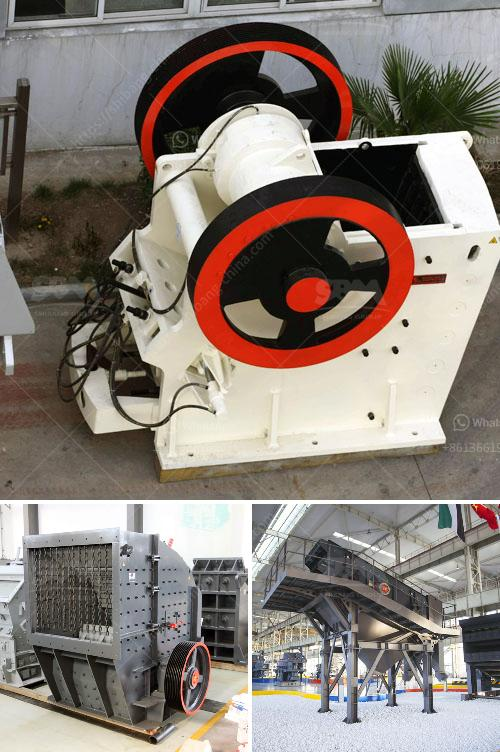

<h3>iron ore beneficiation plant</h3>
Iron ore beneficiation plants are a common sight nowadays across the world. They offer immense opportunities to the countries for economic growth and development. These plants are usually equipped with advanced technology and highly efficient equipment for crushing, grinding, and processing of the raw ore.

Iron ore is one of the most important ores for steel production, which is used widely in the construction, automobile, and other industrial sectors. The extraction of iron ore from the mines is a complex process involving several stages of crushing, grinding, and beneficiation. This process not only ensures the maximum recovery of iron, but also improves the grade of the ore for further processing.

A beneficiation plant is used to process iron ore into a higher-grade product that can be used in steelmaking. The plant process is explained below in more detail.

Crushing and Grinding: The primary process in the beneficiation plant is crushing. This involves breaking down the ore into smaller pieces using jaw crushers, cone crushers, or impact crushers. After crushing, the ore is further ground using ball mills, rod mills, or other types of grinding mills. The purpose of this process is to reduce the size of the ore particles to facilitate the subsequent separation and concentration of iron.

Classification: Once the ore is ground into fine particles, it is classified based on its size and density. This is done using various techniques such as screens, cyclones, or spiral classifiers. The classification helps in separating the ore particles into different size fractions, which facilitates effective separation of iron from the gangue materials.

Magnetic Separation: Magnetic separation is a commonly used technique for separating magnetic minerals from non-magnetic ones. In the case of iron ore beneficiation, magnetic separation is used to remove impurities such as silica, alumina, and phosphorus, which negatively affect the quality and grade of the final product. This process involves passing the ore through magnetic separators, where the magnetic particles are attracted to the magnetic drum and separated from the non-magnetic ones.

Flotation: Flotation is another important process in iron ore beneficiation. It is used to separate valuable minerals from the gangue materials based on their hydrophobic or hydrophilic properties. In this process, the ore is mixed with water and chemicals, such as collectors and frothers, and then agitated to form bubbles. The valuable minerals attach to the bubbles and rise to the surface, while the gangue materials sink to the bottom, thus enabling their separation.

Dewatering: After the beneficiation process, the concentrate obtained from the plant contains a high moisture content. Dewatering is the final step in the process, which involves removing the excess water from the concentrate. This is usually done using vacuum filters or pressure filters, which help in reducing the moisture content to the desired level.

In conclusion, iron ore beneficiation plants play a crucial role in the sustainable development of the mining industry. They not only maximize the recovery of iron from the ore, but also improve its quality and grade for further processing. By employing advanced technology and efficient equipment, these plants ensure cost-effective and eco-friendly operations, thereby contributing to the economic growth and well-being of the communities they operate in.
<h3>Contact us</h3><ul><li><strong>Whatsapp:&nbsp;<a href="https://wa.me/8613661969651">+8613661969651</a></strong></li><li><a href="https://swt.shibang-china.com/?git&amp;zhl&amp;iron ore beneficiation plant"><strong>Online Service(chat now)</strong></a></li></ul><h3>Related</h3><ul><li><a href='mobile plant sand screen for sale.md'>mobile plant sand screen for sale</a></li><li><a href='quartz manufacturing process from mineral.md'>quartz manufacturing process from mineral</a></li><li><a href='dental stone jaw crusher.md'>dental stone jaw crusher</a></li><li><a href='metal crusher manufacturers in colombia.md'>metal crusher manufacturers in colombia</a></li><li><a href='pulverizer for calcium carbonate.md'>pulverizer for calcium carbonate</a></li></ul>