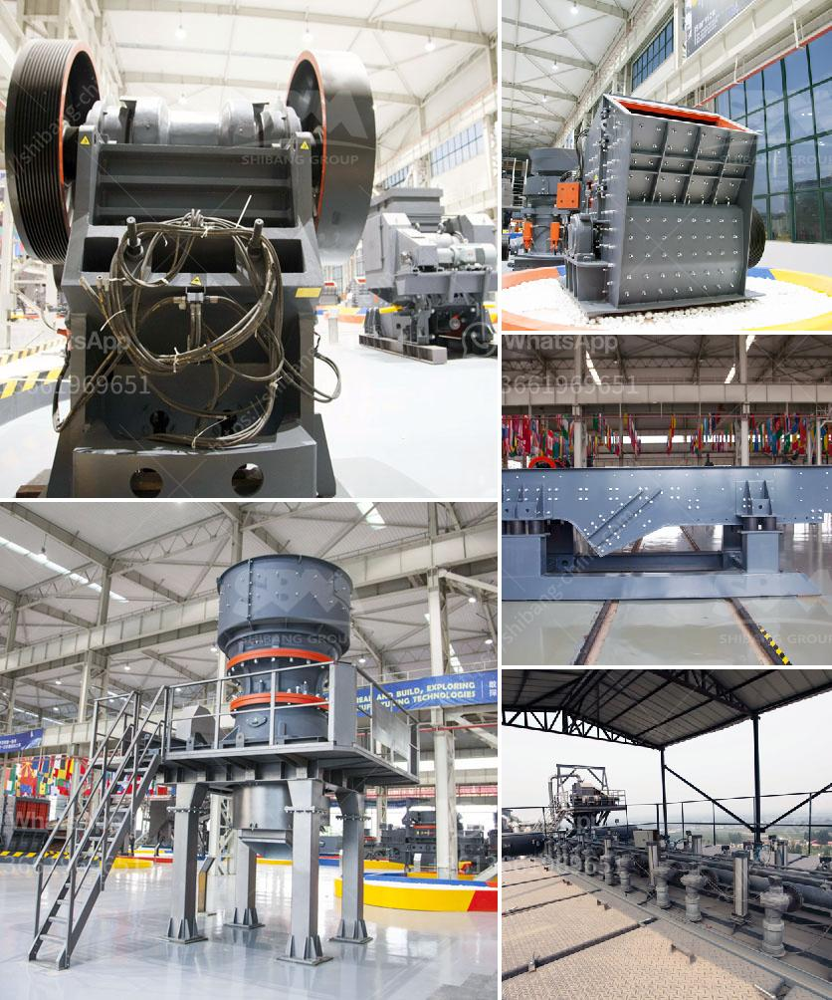

<h3>iron ore beneficiation process for sale</h3>
Iron ore beneficiation is a multi-stage process that raw iron ore undergoes to purify it prior to the process of smelting, which involves melting the ore to remove the metal content. The process of iron ore beneficiation has two complementary goals and these define the methods used to refine it. The iron content in the ore needs to be increased and gangue, which is unwanted material, needs to be removed.

Iron ore beneficiation can be divided into several different processes according to the type and nature of the ore. Initially, the crude ore needs to be crushed and ground to a suitable size for further processing. Depending on the ore’s mineralogical composition and the impurities present, a variety of techniques are employed to remove impurities.

One common method in iron ore beneficiation involves wet grinding the ore to a fine particle size, followed by magnetic separation to recover the magnetite component. The magnetic concentrate is then further refined through flotation, leaching, or other methods to improve the iron concentration. Another technique involves using gravity separation to recover dense iron particles from light impurities, such as silica.

In recent years, advanced technologies have been developed to improve the efficiency of iron ore beneficiation. For example, the use of high-pressure grinding rolls has been shown to significantly reduce energy consumption and increase product fineness. Additionally, advancements in magnetic separation technology have allowed for the recovery of hematite and other iron minerals from low-grade ore deposits.

The global demand for iron ore has been steadily increasing, leading to a rise in the price of iron ore and an opportunity for increased profits for mining companies. As a result, many companies are investing in new iron ore beneficiation facilities to enhance production.

The beneficiation process produces a higher grade of iron ore concentrate suitable for use in ironmaking processes. The discarded gangue material, or tailings, from this process can also be used in construction materials such as cement, thus reducing waste and minimizing environmental impact.

In conclusion, iron ore beneficiation is a complex process that aims to remove impurities from iron ore, increase the iron content, and improve the overall quality of the ore. The process can be further refined through various approaches, such as grinding, magnetic separation, and flotation, to meet the specific needs of different iron ore deposits. With the rise in demand for iron ore, the development of efficient beneficiation processes presents an opportunity for increased profitability for mining companies and a more sustainable use of natural resources.
<h3>Contact us</h3><ul><li><strong>Whatsapp:&nbsp;<a href="https://wa.me/8613661969651">+8613661969651</a></strong></li><li><a href="https://swt.shibang-china.com/?git&amp;zhl&amp;iron ore beneficiation process for sale"><strong>Online Service(chat now)</strong></a></li></ul><h3>Related</h3><ul><li><a href='crusher santa marta malaysia.md'>crusher santa marta malaysia</a></li><li><a href='white clay crusher process.md'>white clay crusher process</a></li><li><a href='roller mill type p500.md'>roller mill type p500</a></li><li><a href='want to lease diamond mining equipment in south africa.md'>want to lease diamond mining equipment in south africa</a></li><li><a href='new quartz plant cost in india.md'>new quartz plant cost in india</a></li></ul>