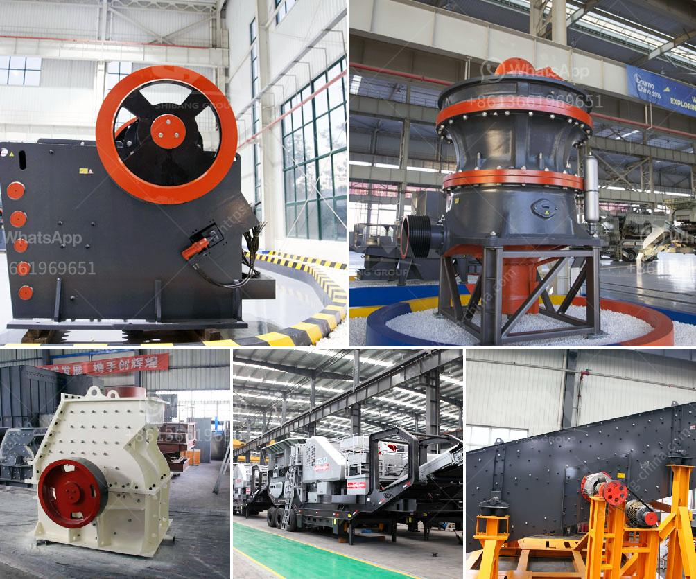

<h3>iron ore beneficiation process price</h3>
Iron ore beneficiation process refers to the process of improving the concentration of iron ore. The beneficiation of iron ore typically occurs in a mineral processing facility, where various techniques are used to separate the ore from the impurities. All iron ore contains some impurities, such as silica (SiO2), alumina (Al2O3), and phosphorus (P), which must be removed to obtain a higher-grade ore suitable for smelting.

The price of iron ore beneficiation process varies depending on the type, quality, and quantity of iron ore. Typically, the process includes crushing, screening, grinding, magnetic separation, and flotation. These steps can be performed manually or automatically. The cost of labor, equipment, energy, and water consumption contribute to the overall price.

One of the key factors affecting the price of iron ore beneficiation process is the quality and abundance of impurities in the ore. If the ore contains a high level of impurities, additional processing steps may be required, leading to increased costs. Additionally, the level of impurities affects the market value of the final product, as higher-grade ores are generally priced higher.

Other factors influencing the price include the availability and cost of energy and water, which are required for various stages of the process. Fluctuations in the prices of these resources can significantly impact the overall price of iron ore beneficiation.

Overall, the price of iron ore beneficiation process depends on multiple factors, including the initial grade of the ore, the complexity of the impurities, and the efficiency of the processing techniques. It is crucial for mining companies and producers to carefully evaluate these factors to optimize the process and minimize costs.
<h3>Contact us</h3><ul><li><strong>Whatsapp:&nbsp;<a href="https://wa.me/8613661969651">+8613661969651</a></strong></li><li><a href="https://swt.shibang-china.com/?git&amp;zhl&amp;iron ore beneficiation process price"><strong>Online Service(chat now)</strong></a></li></ul><h3>Related</h3><ul><li><a href='mica powder machine.md'>mica powder machine</a></li><li><a href='portable cement plant for sale in usa.md'>portable cement plant for sale in usa</a></li><li><a href='ball milling in spray preparation.md'>ball milling in spray preparation</a></li><li><a href='jaw crusher supplier.md'>jaw crusher supplier</a></li><li><a href='priducer prices for stone crusher in usa.md'>priducer prices for stone crusher in usa</a></li></ul>