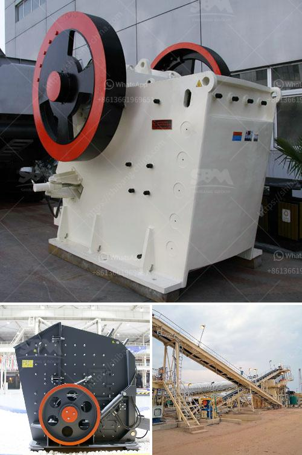

<h3>iron ore beneficiation</h3>
Iron ore beneficiation is a multi-stage process that raw iron ore undergoes to purify it prior to the process of smelting, which involves melting the ore to remove the metal content. The process of iron ore beneficiation has two complementary goals and these define the methods used to refine it.

The iron content in the ore needs to be increased and gangue, which is native rock and minerals of lesser value within the ore itself, must be separated out. Methods such as screening, crushing, and grinding of iron ore are often used in various ways to purify it, along with several stages of magnetic separation.

The iron ore industry classifies the material by the concentration of the metal that is present after iron ore beneficiation has been completed. High-grade iron ore must have a concentration of 65% iron or higher, and medium grade of 62% to 65%. Low-grade iron ore includes all mixtures below 62% iron concentration, which are not considered to be viable types of ore for use in metallurgy.

Several different types of natural iron ore exist, but the two most common types used for metal refining are hematite, Fe2O3, which is usually 70% iron, and magnetite, Fe3O4, which is 72% iron.

Low-grade iron ores also exist, such as limonite, which is hematite bonded to water molecules at 50% to 66% iron, and siderite, FeCO3, that is 48% iron. Regardless of the type of iron ore that is being mined, the most important thing reflecting its quality is its purity.

Pure hematite is about 70% iron while taconite, a type of magnetite, contains about 25% to 30% iron. In a beneficiation process, ore is finely ground to separate impurities. Therefore, the product ore inevitably becomes finer. Fines generated during the screening of high-grade ore can be agglomerated in a sintering plant; however, the finer fines resulting from the beneficiation process cannot usually be processed in a sintering plant and must be agglomerated in a pelletizing plant.

Overall, the iron ore beneficiation process includes several important steps, such as the crushing, grinding, and concentration of raw materials, followed by the payment of heavy media beneficiation, screening, and sintering. Iron ore beneficiation is a complex process that requires a lot of time, resources, and money. Understanding this process, from start to finish, will help stakeholders appreciate the time and effort that goes into the iron ore beneficiation process.
<h3>Contact us</h3><ul><li><strong>Whatsapp:&nbsp;<a href="https://wa.me/8613661969651">+8613661969651</a></strong></li><li><a href="https://swt.shibang-china.com/?git&amp;zhl&amp;iron ore beneficiation"><strong>Online Service(chat now)</strong></a></li></ul><h3>Related</h3><ul><li><a href='stone crusher machine for sale in kenya.md'>stone crusher machine for sale in kenya</a></li><li><a href='stone crusher 7 tonne per day.md'>stone crusher 7 tonne per day</a></li><li><a href='calcium carbonate plant sell in india.md'>calcium carbonate plant sell in india</a></li><li><a href='suplier sand making machine from philippines.md'>suplier sand making machine from philippines</a></li><li><a href='screen for iron ore pellets.md'>screen for iron ore pellets</a></li></ul>