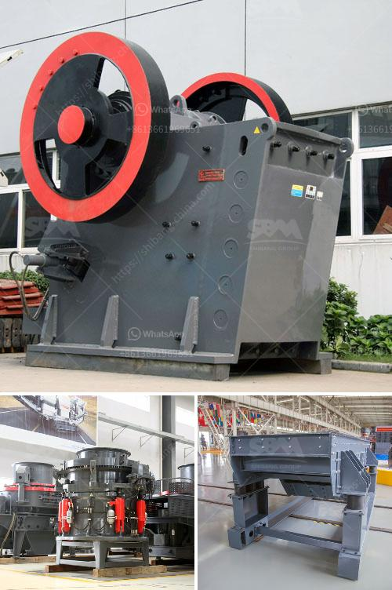

<h3>iron ore crushed second hand machines</h3>
Iron ore, one of the most abundant mineral resources, serves as a cornerstone for many industries around the world. Extracting and processing iron ore requires a substantial amount of machinery and equipment, both of which can be costly. However, budget-conscious businesses can benefit from purchasing second-hand machines, specifically those used for crushing iron ore.

The process of extracting iron ore starts with drilling and blasting large rocks, which are then transported to crushers. These crushers, commonly known as stone crushers, consist of a crushing chamber that helps break down the ore into smaller pieces. While new crushers can be expensive, second-hand machines offer businesses a cost-effective alternative without compromising on the quality of crushing efficiency.

One of the primary advantages of purchasing second-hand machines is the reduced upfront cost. The mining industry, like any other, experiences fluctuations in demand and market conditions that can impact budgets. Investing in second-hand machines allows businesses to allocate their resources more efficiently, keeping costs low while maximizing returns.

Furthermore, purchasing iron ore crushed second-hand machines is beneficial in terms of reducing waiting times. For businesses experiencing a sudden surge in demand or requiring immediate replacement of outdated equipment, second-hand machines can bridge the gap between the need for machines and their acquisition.

To ensure the reliability and functionality of second-hand machines, it is essential to conduct thorough inspections and tests before finalizing any purchases. Investing in reputable sellers who can provide detailed information about the history and maintenance records of the machines is crucial. By doing so, businesses can minimize the risk of investing in faulty or inefficient equipment.

Moreover, second-hand machines contribute to sustainability efforts. Reusing machinery that is in good working condition reduces the demand for new equipment, ultimately mitigating the environmental impact associated with manufacturing new machines. As the world increasingly emphasizes sustainable practices, the resourcefulness of second-hand machines becomes even more compelling.

In addition to the economic and environmental benefits, second-hand machines come with the added advantage of being tried and tested. Before entering the second-hand market, these machines have already proven their reliability and durability in the field. Buyers can access valuable insights and reviews from previous owners, which can inform their decision-making process.

While second-hand machines have many advantages, they are not without their limitations. Buyers must consider factors such as the age of the machine, its maintenance history, and any potential wear and tear. Being aware of these risks allows businesses to make informed decisions and negotiate appropriate pricing.

In conclusion, the availability of second-hand machines presents valuable opportunities for businesses in the mining industry looking to save costs and maximize productivity. By conducting thorough inspections and working with reputable sellers, companies can acquire reliable machinery at a fraction of the cost. Furthermore, the use of second-hand machines contributes to sustainability efforts by reducing the demand for new equipment. Balancing affordability, reliability, and environmental responsibility, investing in iron ore crushed second-hand machines proves to be a practical choice for many businesses.
<h3>Contact us</h3><ul><li><strong>Whatsapp:&nbsp;<a href="https://wa.me/8613661969651">+8613661969651</a></strong></li><li><a href="https://swt.shibang-china.com/?git&amp;zhl&amp;iron ore crushed second hand machines"><strong>Online Service(chat now)</strong></a></li></ul><h3>Related</h3><ul><li><a href='diamond mobile wash plant price.md'>diamond mobile wash plant price</a></li><li><a href='bentonite powder making.md'>bentonite powder making</a></li><li><a href='which way should the ball mill rotate.md'>which way should the ball mill rotate</a></li><li><a href='egypt gypsum powder manufacturer.md'>egypt gypsum powder manufacturer</a></li><li><a href='quartz powder ball mill in tamilnadu.md'>quartz powder ball mill in tamilnadu</a></li></ul>