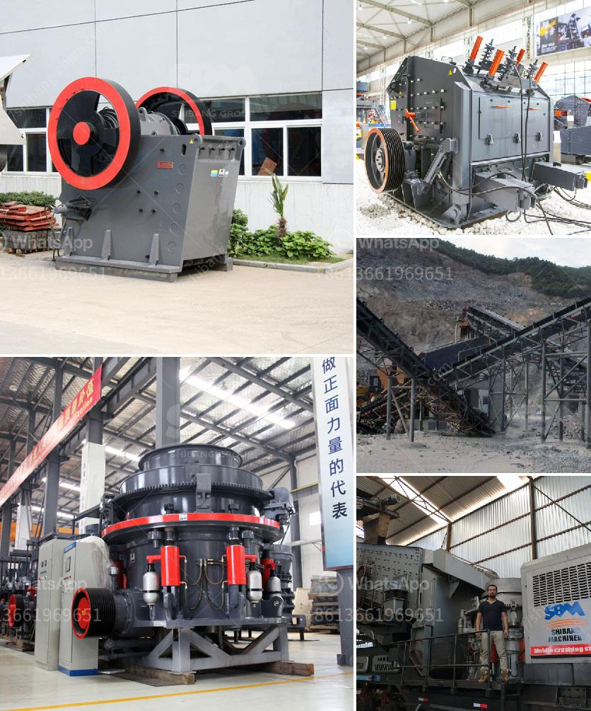

<h3>iron ore crusher for sale</h3>
Iron ore crusher, also known as the iron ore crushing station, is a kind of crushing machinery that can break the ore to different specifications with various patterns. It has a wide range of uses, and its performance has been praised by users. Today, with the economic development, people's living standards have improved significantly. The demand for iron ore resources is also increasing, and the market for iron ore crushers is very large. In this article, we will discuss the relevant information about iron ore crushers for sale.

The iron ore crusher is a device that crushes large pieces of raw iron ore into fine materials. The iron ore crushing process includes several major processes such as feeding, primary crushing, secondary crushing, screening, and dry separation. In the crushing process, the three-stage closed-circuit crushing is a modern method suitable for high-hardness iron ore crushing. It can complete the crushing and partial dissociation of the ore, improve the subsequent grinding efficiency, and reduce the load on the grinding machine.

When choosing an iron ore crusher, users need to consider the nature of the ore, the production capacity, the size of the finished product, and other factors. The available crushers are mainly jaw crushers and cone crushers. The jaw crusher has compressive strength up to 320 MPa, which is suitable for the primary crushing of materials. The cone crusher has strong processing capacity and low operating cost, which is suitable for medium and fine crushing of materials. The impact crusher and hammer crusher are also commonly used.

The iron ore crusher for sale produced by the company is a kind of equipment that uses impact energy to crush materials. It can crush materials into various specifications according to customer requirements, and is mainly used for fine crushing of iron ore. The product has stable performance, low cost, high crushing efficiency, and is convenient to use and maintain. It is a popular choice for customers who need to crush iron ore.

In addition to the iron ore crusher, customers can also choose other auxiliary equipment such as feeders, conveyors, vibrating screens, etc. to form a complete iron ore crushing production line. The vibrating feeder is mainly used to uniformly and continuously feed large materials into the jaw crusher or cone crusher for coarse crushing. The vibrating screen is used to screen the crushed materials after crushing, and the finished product is sent to the specific iron ore storage through the belt conveyor.

In summary, with the continuous expansion of the global iron ore market, the demand for iron ore crushers is also increasing. The iron ore crusher for sale produced by our company has reasonable equipment configuration, reliable performance, and excellent quality. Let us strengthen our production strength and gain a firm foothold in the industry. If you are interested in our iron ore crusher, please contact us for more detailed information and the latest quotation.
<h3>Contact us</h3><ul><li><strong>Whatsapp:&nbsp;<a href="https://wa.me/8613661969651">+8613661969651</a></strong></li><li><a href="https://swt.shibang-china.com/?git&amp;zhl&amp;iron ore crusher for sale"><strong>Online Service(chat now)</strong></a></li></ul><h3>Related</h3><ul><li><a href='machine to crush quartz into powder.md'>machine to crush quartz into powder</a></li><li><a href='granite impact crusher.md'>granite impact crusher</a></li><li><a href='cara menghitung kapasitas pada belt conveyor.md'>cara menghitung kapasitas pada belt conveyor</a></li><li><a href='dental stone jaw crusher.md'>dental stone jaw crusher</a></li><li><a href='china manufacturers of sand washing machine.md'>china manufacturers of sand washing machine</a></li></ul>