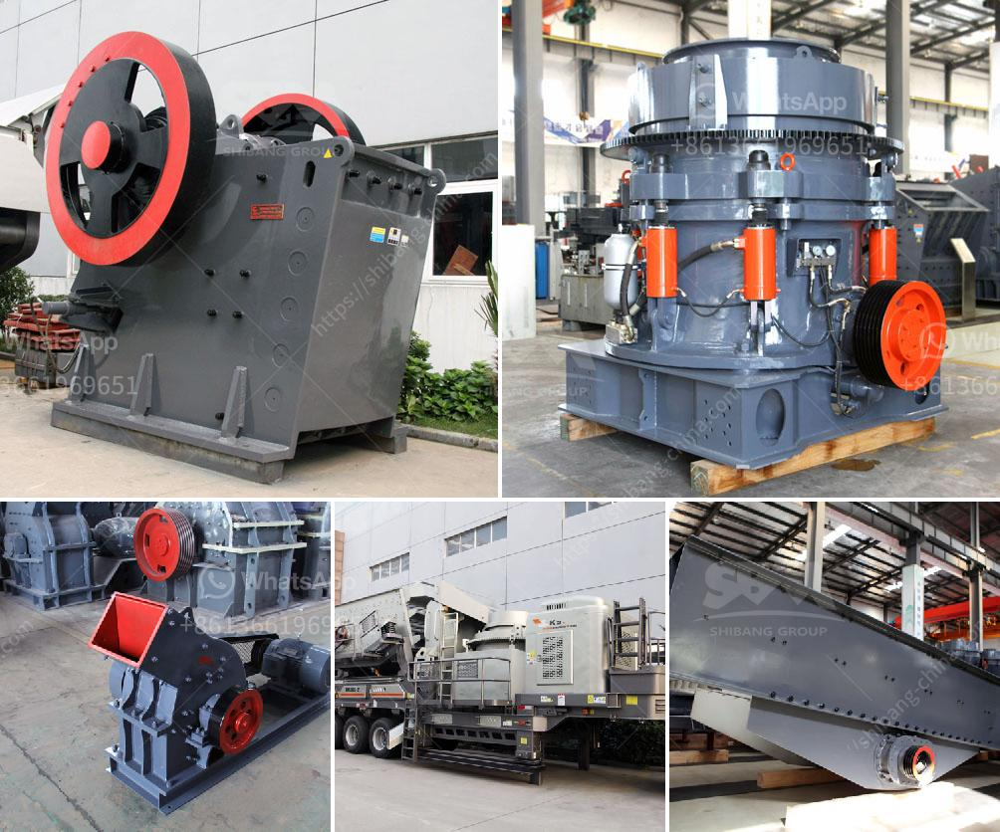

<h3>iron ore machine process</h3>
Iron ore machine refers to the machines used for iron ore production. The machines used in iron ore mining and processing include crushing machines, grinding machines, beneficiation machines, and other auxiliaries such as transportation, communication, and water supply amenities.

The initial step in iron ore beneficiation is crushing and grinding. Typically, the machines used are jaw crushers, cone crushers, and ball mills. Crushing and grinding enable the ore particles to be reduced in size, resulting in higher concentration of iron content. This concentration is often called by various names such as iron ore concentrate or ore fines. The process also allows for the removal of impurities such as silica, phosphorus, and sulfur.

Next, beneficiation is the process of separating the ore material into usable and waste components. This involves various stages of crushing, screening, and sorting. The most common beneficiation equipment includes flotation machines, electrostatic and magnetic separators, and gravity beneficiation equipment.

The different processes involved in iron ore processing include grinding, screening, desulfurization, separation, concentration, and beneficiation. Iron ore needs to be processed to concentrate iron, ultimately resulting in the production of pig iron and steel. These products are used in various industries for their inherent strength and heat resistance properties.

Iron ore processing requires several steps to achieve the desired grade. The processing involves crushing, grinding, concentrating, and dewatering. Each step is briefly described below:

1. Crushing: Crush the large iron ore into smaller pieces that meet the size requirements. This involves two stages of crushing – primary crushing and secondary crushing.

2. Grinding: As the name implies, the purpose of grinding is to achieve the desired particle size by rolling the steel balls against the ore particles. The grinding process consumes a large amount of energy, and it can generate substantial heat, making the mill ventilation essential to cooling the equipment and preventing overheating of the ore.

3. Concentration: The concentration process mainly involves the separation of valuable minerals from the gangue. It utilizes the difference in magnetic properties of the ore and the gangue minerals to achieve a separation.

4. Dewatering: Dewatering is an essential part of iron ore beneficiation. It removes unwanted moisture from the ore and makes it easier to handle and transport the concentrate.

In summary, iron ore mining and processing machines can be categorized into four main types: crushing, grinding, beneficiation, and auxiliary equipment. Each of these machines plays a crucial role in the mining process and will ensure optimal production efficiency and scalability in the operation. The final product of iron ore concentrate is used to manufacture pig iron, which in turn is used to produce steel.
<h3>Contact us</h3><ul><li><strong>Whatsapp:&nbsp;<a href="https://wa.me/8613661969651">+8613661969651</a></strong></li><li><a href="https://swt.shibang-china.com/?git&amp;zhl&amp;iron ore machine process"><strong>Online Service(chat now)</strong></a></li></ul><h3>Related</h3><ul><li><a href='aggregates crashing plant in nigeria.md'>aggregates crashing plant in nigeria</a></li><li><a href='sell of crushing machine in lima.md'>sell of crushing machine in lima</a></li><li><a href='safety sings for crusher plant and quarry.md'>safety sings for crusher plant and quarry</a></li><li><a href='roller raymond mill.md'>roller raymond mill</a></li><li><a href='quartz stone 30 80 plant process.md'>quartz stone 30 80 plant process</a></li></ul>