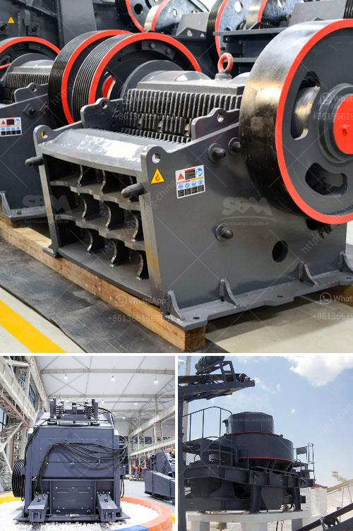

<h3>iron ore processing machine cost</h3>
Iron ore is a crucial raw material for the manufacturing industry. As demand for steel and other products made from iron ore continues to rise, the importance of efficient iron ore processing machines also becomes evident. The iron ore processing industry is heavily reliant on large-scale equipment and machinery to carry out the extraction and refinement of this valuable metal. However, the cost associated with such machines can vary greatly depending on several factors.

One of the primary factors affecting the cost of iron ore processing machines is the type of machine being used. Different machines serve different purposes in the processing chain, such as crushing, grinding, screening, and magnetic separation. Each of these processes requires specialized machinery, and the cost of acquiring and operating these machines can add up significantly.

Another factor that influences the cost of iron ore processing machines is the size and capacity of the equipment. Larger and more powerful machines tend to cost more, as they require more materials, labor, and maintenance. However, investing in larger machines can also result in higher production capacities, allowing for more efficient processing and reducing overall costs in the long run.

The availability and location of the iron ore mine are critical considerations when determining the cost of processing machines. If the mine is located in a remote area or lacks adequate infrastructure, transportation costs can be significant. Additionally, the accessibility and quality of energy sources, such as electricity or fuel, can also impact costs.

Furthermore, technological advancements and innovations in the field of iron ore processing have improved the efficiency and cost-effectiveness of machines over the years. State-of-the-art equipment often comes with a higher price tag, but it can provide significant long-term savings through increased productivity and reduced downtime.

In summary, the cost of iron ore processing machines can vary widely depending on factors such as the type, size, capacity, location, and technological advancements. While investing in high-quality machinery may initially seem expensive, it can lead to significant cost savings in the long run. As the demand for iron ore continues to grow, companies in the industry must carefully consider the cost implications of their processing equipment to remain competitive in the market.
<h3>Contact us</h3><ul><li><strong>Whatsapp:&nbsp;<a href="https://wa.me/8613661969651">+8613661969651</a></strong></li><li><a href="https://swt.shibang-china.com/?git&amp;zhl&amp;iron ore processing machine cost"><strong>Online Service(chat now)</strong></a></li></ul><h3>Related</h3><ul><li><a href='second hand gypsum powder line.md'>second hand gypsum powder line</a></li><li><a href='rent a rock crusher saudi.md'>rent a rock crusher saudi</a></li><li><a href='mining equipment for hire in kenya.md'>mining equipment for hire in kenya</a></li><li><a href='coal washing plant for sale.md'>coal washing plant for sale</a></li><li><a href='company where they sell industrial mills.md'>company where they sell industrial mills</a></li></ul>