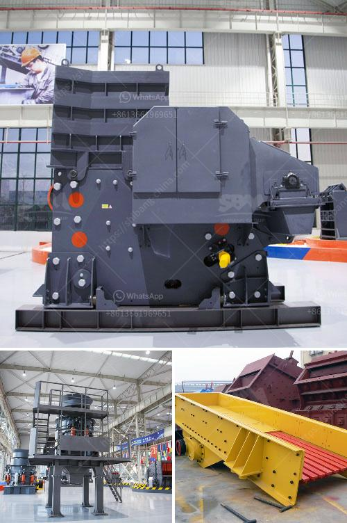

<h3>iron ore processing pdf</h3>
Iron ore processing is a complex undertaking that involves a myriad of steps and processes. The overall process involves crushing, screening, grinding, magnetic separation, flotation, and smelting. During all these processes, high amounts of energy are consumed, excessive pollutants are released into the environment, and enormous amounts of water are used. This article will provide a brief overview of the iron ore processing industry and its environmental impact.

The first step in iron ore processing is crushing and screening. Large iron ore pieces are initially broken down into smaller fragments and then screened to determine their size. The ore is then subjected to grinding, which reduces the particle size to a more manageable level. Grinding is typically done using a semi-autogenous (SAG) mill followed by a ball mill.

After grinding, the ore undergoes magnetic separation to separate the iron-bearing minerals from the non-magnetic components. This is done using powerful magnets that attract and isolate the iron particles. The magnetic concentrate is then further processed through a flotation circuit to remove impurities and improve the iron content.

Flotation involves adding certain chemicals to the ore slurry to make the iron particles adhere to air bubbles. These air bubbles are then floated to the surface, where they are collected as froth. The froth is then dried and smelted in a furnace to produce iron ore concentrate, which is subsequently transported to steel mills for further processing.

One of the major environmental concerns associated with iron ore processing is the significant energy consumption. The grinding process, in particular, consumes a considerable amount of energy due to the size reduction required. This energy is generally generated from fossil fuels, leading to greenhouse gas emissions and contributing to climate change.

Another issue is the release of pollutants during the processing stages. The crushing and grinding stages may release dust particles, which can lead to respiratory problems for workers and nearby communities if not properly controlled. The flotation process can also release harmful chemicals, such as sulfur dioxide and cyanide, into the air and water.

Water usage is another significant concern in iron ore processing. Enormous amounts of water are required for processes such as grinding, flotation, and smelting. This water can become contaminated with chemicals and pollutants, further exacerbating the environmental impact. Additionally, the extraction of water from natural sources, such as rivers and lakes, can have detrimental effects on local ecosystems and biodiversity.

To mitigate these environmental impacts, the iron ore processing industry is continuously exploring and implementing more sustainable practices. This includes adopting cleaner technologies, such as using renewable energy sources instead of fossil fuels and optimizing water usage through recycling and conservation measures.

In conclusion, iron ore processing is a complex and energy-intensive process that has significant environmental impacts. It consumes large amounts of energy, releases pollutants, and utilizes vast quantities of water. However, the industry is actively seeking ways to reduce its environmental footprint through the adoption of cleaner technologies and sustainable practices.
<h3>Contact us</h3><ul><li><strong>Whatsapp:&nbsp;<a href="https://wa.me/8613661969651">+8613661969651</a></strong></li><li><a href="https://swt.shibang-china.com/?git&amp;zhl&amp;iron ore processing pdf"><strong>Online Service(chat now)</strong></a></li></ul><h3>Related</h3><ul><li><a href='calcium carbonate grinding mill price.md'>calcium carbonate grinding mill price</a></li><li><a href='south africa manganese ore jaw crusher south africa.md'>south africa manganese ore jaw crusher south africa</a></li><li><a href='copper concentrate plant equipment list.md'>copper concentrate plant equipment list</a></li><li><a href='limestone production machinery.md'>limestone production machinery</a></li><li><a href='roller mill type p500.md'>roller mill type p500</a></li></ul>