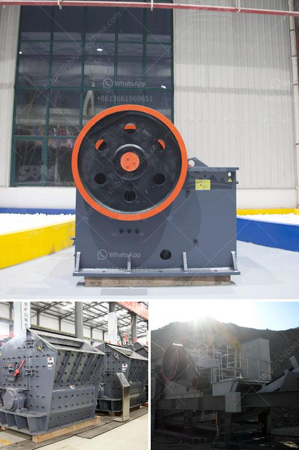

<h3>iron ore production from chrysotile</h3>
Iron ore is a crucial raw material used in various industries, including steel production, construction, and manufacturing. Traditionally, iron ore has been obtained through mining and extraction processes from deposits found in different parts of the world. However, recent innovative developments have opened up a new pathway for iron ore production – chrysotile.

Chrysotile is a fibrous silicate mineral that has been predominantly known for its use in asbestos products. However, with growing concerns around the health hazards associated with asbestos, there has been a decline in its global demand and production. As a result, researchers and experts have been exploring alternative applications for chrysotile, and iron ore production has emerged as a promising option.

The process of iron ore production from chrysotile involves several steps. Initially, the chrysotile is mined and subjected to a crushing and grinding process to reduce its particle size. This results in the generation of a fine powder, containing significant amounts of iron-rich minerals. The iron-rich powder is then subjected to magnetic separation, where magnetic forces are employed to separate the iron-containing minerals from the rest of the material.

Once the iron-containing minerals are isolated, they undergo further processes to purify and concentrate the iron ore. This may involve techniques like flotation, where air bubbles are used to separate impurities from the iron-rich material. The concentrated iron ore is then dried and often transformed into pellets or briquettes, which can be more efficiently transported and used in various industries.

The production of iron ore from chrysotile offers several advantages. Firstly, it opens up new sources of iron ore, reducing the dependence on traditional mining operations. This can help diversify the global iron ore supply chain and mitigate risks associated with the concentration of iron ore production in specific regions.

Secondly, using chrysotile for iron ore production also contributes to the sustainable utilization of a mineral resource that has faced declining demand due to health and safety concerns. By repurposing chrysotile for iron ore production, its potential adverse effects can be minimized, while simultaneously meeting the growing demands of various industries.

However, it must be emphasized that the conversion of chrysotile into iron ore is a specialized process that requires extensive research, development, and strict adherence to safety regulations. Proper handling and disposal of any remaining asbestos fibers during the production process are crucial to prevent the release of harmful particles into the environment and to protect workers.

Overall, iron ore production from chrysotile presents a promising pathway to secure iron ore supplies, diversify sources, and promote sustainable use of mineral resources. Ongoing research and technological advancements in this field can further enhance the efficiency and safety of this innovative production method, contributing to the sustainable growth of the iron ore industry.
<h3>Contact us</h3><ul><li><strong>Whatsapp:&nbsp;<a href="https://wa.me/8613661969651">+8613661969651</a></strong></li><li><a href="https://swt.shibang-china.com/?git&amp;zhl&amp;iron ore production from chrysotile"><strong>Online Service(chat now)</strong></a></li></ul><h3>Related</h3><ul><li><a href='china roller mill kenya.md'>china roller mill kenya</a></li><li><a href='german made stone crushers.md'>german made stone crushers</a></li><li><a href='jaw concrete crusher price.md'>jaw concrete crusher price</a></li><li><a href='ball mill suppliers china.md'>ball mill suppliers china</a></li><li><a href='list of compartment of gypsum crusher plant.md'>list of compartment of gypsum crusher plant</a></li></ul>