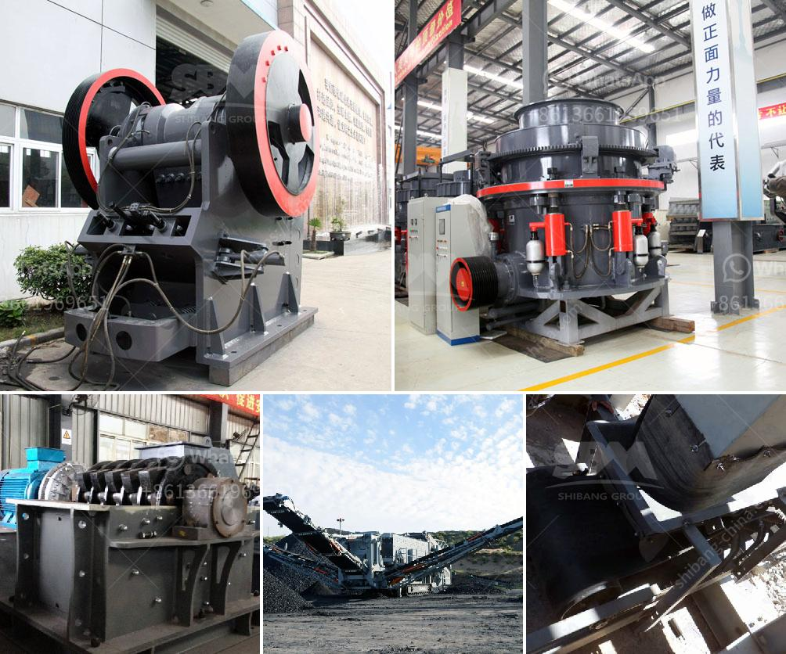

<h3>iron processing equipment cost</h3>
Iron processing equipment cost refers to the expenses incurred during the procurement, installation, and maintenance of equipment used in the iron processing industry. Iron is a crucial material in various sectors, including construction, automotive, and manufacturing. To utilize iron in these industries, it needs to undergo a series of processing steps that require specialized equipment. The cost of acquiring and maintaining this equipment significantly impacts the overall profitability and efficiency of iron processing operations.

The major factors contributing to iron processing equipment cost include the type of equipment required, its capacity, quality, and technological advancements. Equipment commonly used in iron processing includes crushers, sifters, grinding mills, conveyors, ore separators, and smelting furnaces. Each equipment type has its own cost structure and maintenance requirements, depending on the complexity of its operation.

One primary consideration in equipment cost is its capacity or output per unit time. High-capacity equipment can process larger volumes of iron ore, resulting in increased productivity and cost-effectiveness. However, higher capacity equipment typically comes with a higher price tag. Therefore, iron processing plants need to carefully analyze their production requirements to strike a balance between capacity and cost.

Another aspect to consider is the quality and durability of the equipment. Investing in high-quality equipment may initially seem expensive, but it often leads to lower maintenance and replacement costs in the long run. Equipment made from superior materials and designed with advanced technology can withstand the harsh conditions of iron processing, reducing downtime and enhancing overall operational efficiency.

Technological advancements play a significant role in the cost of iron processing equipment. Advanced equipment with automation and computerized controls offers numerous benefits, including improved production precision, reduced manual labor, and increased safety. However, incorporating such technology can mean higher initial investments. Iron processing plants need to assess the potential returns on investment that advanced technology brings, especially when it comes to increased productivity and decreased labor costs over time.

Furthermore, transportation and installation costs are additional expenses to consider. Iron processing equipment is often bulky and heavy, requiring specialized handling during transportation and installation. The location of the supplier can also impact transportation costs. To minimize expenses, iron processing plants should seek local suppliers whenever possible. Additionally, careful planning and coordination with logistics providers can help streamline transportation processes and reduce associated costs.

Maintenance and repair requirements are ongoing expenses that should not be overlooked. Regular inspections, repairs, and timely replacement of worn-out parts are critical to ensuring the longevity and efficiency of iron processing equipment. Neglecting maintenance can result in unexpected breakdowns, costly repairs, and extended downtime. It is essential to factor in maintenance costs when evaluating the overall expenses of iron processing equipment.

In conclusion, iron processing equipment cost depends on various factors, including the type, capacity, quality, technological advancements, transportation, installation, and maintenance requirements. Iron processing plants must carefully assess their production needs and budget constraints to make informed decisions when procuring equipment. By balancing equipment cost with productivity and quality, iron processing plants can optimize their operations and maintain a competitive edge in the industry.
<h3>Contact us</h3><ul><li><strong>Whatsapp:&nbsp;<a href="https://wa.me/8613661969651">+8613661969651</a></strong></li><li><a href="https://swt.shibang-china.com/?git&amp;zhl&amp;iron processing equipment cost"><strong>Online Service(chat now)</strong></a></li></ul><h3>Related</h3><ul><li><a href='sand washing plant in turkey.md'>sand washing plant in turkey</a></li><li><a href='manufacture of ball mill stator.md'>manufacture of ball mill stator</a></li><li><a href='dental stone jaw crusher.md'>dental stone jaw crusher</a></li><li><a href='basic machines used stone crusher.md'>basic machines used stone crusher</a></li><li><a href='small concrete crusher.md'>small concrete crusher</a></li></ul>