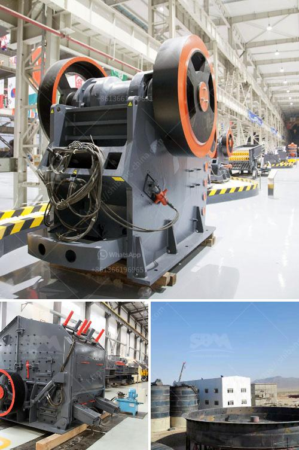

<h3>iron separator from steel slag</h3>
Steel production is a complex process that generates a considerable amount of by-products, including steel slag. Steel slag is a by-product of steelmaking that is generated during the separation of molten steel from impurities in a blast furnace. This by-product has long been considered a waste material, but recent advancements have revealed its hidden potential.

Iron separator technology has emerged as a revolutionary solution for the utilization of steel slag. This innovative technology allows for the extraction of iron from the slag, making it a valuable resource that can be used in various industries. The iron separator works by separating the iron particles from the slag, allowing for their reuse in steel production or other applications.

One of the main advantages of iron separator technology is its environmental benefits. By removing iron from steel slag, this technology helps reduce waste and decrease the need for mining iron ore. This not only conserves natural resources but also contributes to a greener and more sustainable steel industry.

Additionally, the extraction of iron from steel slag through an iron separator can lead to economic benefits. Iron is an essential component of steel production, and by reusing iron particles from the slag, steel manufacturers can reduce their production costs. Moreover, the availability of a local source of iron can help reduce reliance on imported iron ore, further boosting the economy.

Furthermore, the iron separated from steel slag can be used in a range of applications. It can be utilized in the production of construction materials, such as concrete and asphalt, enhancing their strength and durability. Iron particles can also be used as a raw material in the manufacturing of fertilizers, saving costs and reducing the dependence on traditional sources.

In conclusion, the development of iron separator technology has transformed steel slag from a waste material into a valuable resource. This revolutionary solution offers numerous benefits, including environmental conservation, economic advantages, and versatile applications. As steel production continues to grow, the utilization of iron separator technology provides a sustainable and efficient way to manage steel slag, contributing to a greener future.
<h3>Contact us</h3><ul><li><strong>Whatsapp:&nbsp;<a href="https://wa.me/8613661969651">+8613661969651</a></strong></li><li><a href="https://swt.shibang-china.com/?git&amp;zhl&amp;iron separator from steel slag"><strong>Online Service(chat now)</strong></a></li></ul><h3>Related</h3><ul><li><a href='changchai ballast crusher.md'>changchai ballast crusher</a></li><li><a href='primary crushers.md'>primary crushers</a></li><li><a href='coal washing plant suppliers.md'>coal washing plant suppliers</a></li><li><a href='estimated cost of building a steel mill.md'>estimated cost of building a steel mill</a></li><li><a href='crusher plant for sale in saudi.md'>crusher plant for sale in saudi</a></li></ul>