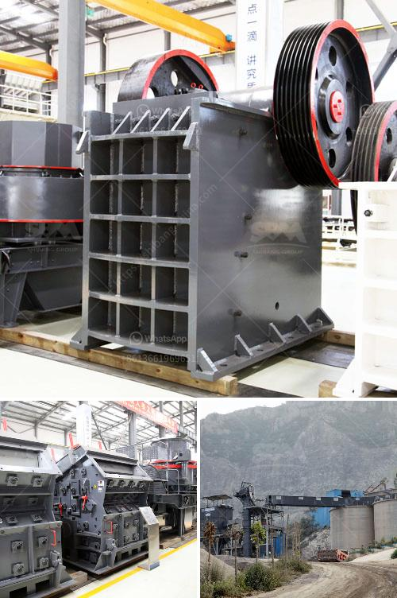

<h3>iron slag crushing ball mill in nagpur</h3>
Iron slag is a common byproduct of iron production. It can be recycled and used in various industries such as construction, cement, and agriculture. However, crushing iron slag into a fine powder and then utilizing it for different applications is a daunting task. The ball mill equipment is well suited for this operation as it can finely grind iron slag with high efficiency and low energy consumption.

Iron slag crushing ball mill in Nagpur is designed to grind various ores and other abrasive materials. It is an efficient tool for grinding many materials into fine powder. The ball mill is used to grind many kinds of mine and other materials, or to select the mine. Iron slag crushing ball mill in Nagpur provides a variety of different types and models, suitable for various customers to choose from.

Iron slag crushing ball mill in Nagpur has accumulated rich experience in the production of grinding equipment. With continuously updated technology, its grinding equipment has gradually been improved to meet the needs of customers. At the same time, it has been continuously optimized in terms of energy consumption and automation.

The crushing efficiency and output of iron slag crushing ball mill in Nagpur are higher than other grinding equipment. With the application of advanced technology, the energy consumption per unit of output is significantly reduced, effectively reducing the production cost of customers. In addition, it has the advantages of stable operation, easy operation and maintenance, and long service life.

In conclusion, iron slag crushing ball mill in Nagpur is an efficient tool for grinding various materials into fine powder. It has the advantages of high grinding efficiency, low energy consumption, and stable operation. With continuous technological innovation, its performance and quality have been continuously improved, meeting the diverse needs of customers. If you are in need of iron slag grinding equipment, selecting iron slag crushing ball mill in Nagpur should be your wise choice.
<h3>Contact us</h3><ul><li><strong>Whatsapp:&nbsp;<a href="https://wa.me/8613661969651">+8613661969651</a></strong></li><li><a href="https://swt.shibang-china.com/?git&amp;zhl&amp;iron slag crushing ball mill in nagpur"><strong>Online Service(chat now)</strong></a></li></ul><h3>Related</h3><ul><li><a href='coal crusher for sale in south africa.md'>coal crusher for sale in south africa</a></li><li><a href='ball mill shell materials.md'>ball mill shell materials</a></li><li><a href='diamond mining equipment companies in usa.md'>diamond mining equipment companies in usa</a></li><li><a href='price of concrete crushing machine for sale.md'>price of concrete crushing machine for sale</a></li><li><a href='used stone crusher in usa for sale.md'>used stone crusher in usa for sale</a></li></ul>