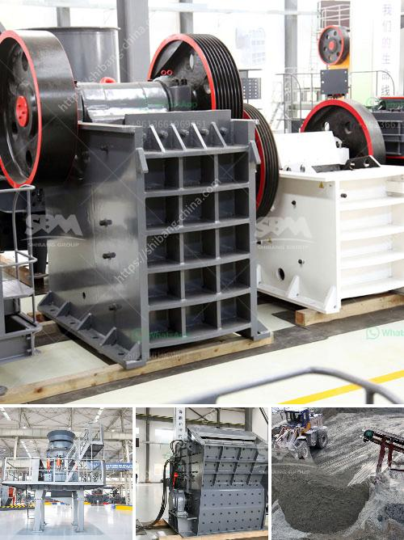

<h3>japan granite machine</h3>
Japan has long been known for its commitment to quality, and the granite machines produced in the country are a prime example of this dedication. These machines have become synonymous with excellence and precision, making them highly sought after in the global market.

What sets Japan granite machines apart from their counterparts is their meticulous craftsmanship and attention to detail. Each machine is meticulously designed and engineered to ensure maximum performance and longevity. The use of advanced technologies and high-quality materials further enhances their efficiency and durability.

One of the key factors contributing to the success of Japan granite machines is the country's deep-rooted culture of craftsmanship. Japanese artisans take immense pride in their work and possess an unparalleled level of skill and expertise. This dedication is reflected in every aspect of the machine, from its design and production to its functionality and performance.

The precision offered by Japanese granite machines is unparalleled, making them the preferred choice for a wide range of industries. Whether it is cutting, shaping, or polishing granite, these machines can deliver flawless results with utmost accuracy. They are known for their ability to work with even the hardest and densest types of granite, making them ideal for both small-scale and large-scale projects.

Furthermore, Japan granite machines are backed by a strong aftersales service network, ensuring that customers receive prompt assistance and maintenance when needed. This ensures that these machines continue to deliver peak performance for years to come.

In conclusion, Japan granite machines are a symbol of excellence and precision in the global market. Their meticulous craftsmanship, advanced technologies, and commitment to quality make them highly sought after by industries around the world. With a long-standing culture of craftsmanship and a dedication to customer satisfaction, Japan continues to set the benchmark for granite machines. Investing in a Japan granite machine is not only a testament to quality but also a guarantee of superior performance and reliability.
<h3>Contact us</h3><ul><li><strong>Whatsapp:&nbsp;<a href="https://wa.me/8613661969651">+8613661969651</a></strong></li><li><a href="https://swt.shibang-china.com/?git&amp;zhl&amp;japan granite machine"><strong>Online Service(chat now)</strong></a></li></ul><h3>Related</h3><ul><li><a href='pulverizer for calcium carbonate.md'>pulverizer for calcium carbonate</a></li><li><a href='crusher manufacturer china.md'>crusher manufacturer china</a></li><li><a href='manufacturers of conveyor belts.md'>manufacturers of conveyor belts</a></li><li><a href='dry grinding ball mills for lime.md'>dry grinding ball mills for lime</a></li><li><a href='stone paper production process.md'>stone paper production process</a></li></ul>