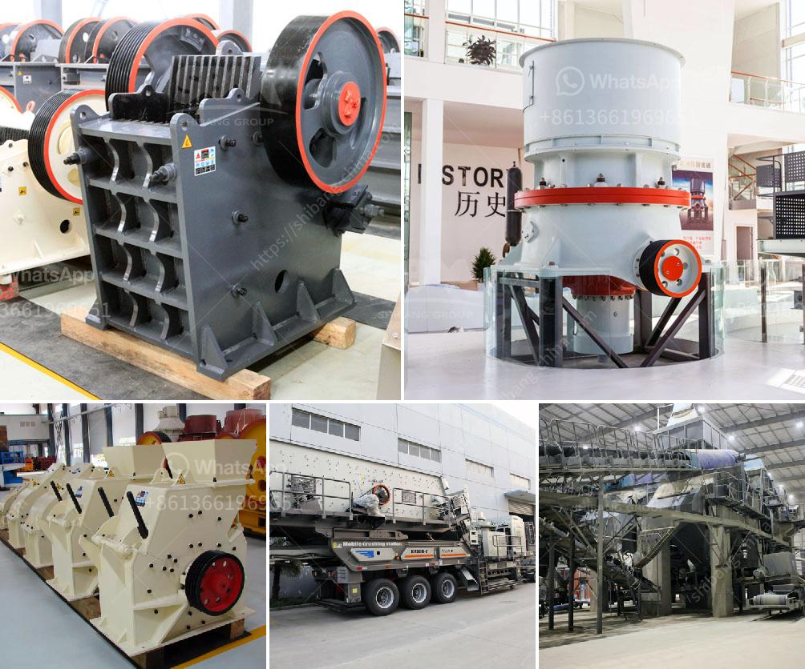

<h3>jaw concrete crusher price</h3>
The jaw concrete crusher, also called a jaw crusher, is a concrete crushing machine used in the breaking of large pieces of concrete into smaller chunks. This agricultural tool is typically used in construction sites to demolish concrete structures and recycle the waste material into new usable products.

One of the key advantages of the jaw concrete crusher is its ability to handle a wide range of materials. It can crush both reinforced and non-reinforced concrete, as well as asphalt and bricks. This versatility makes it a valuable tool for construction companies and contractors who deal with various types of demolition projects. Additionally, the machine's compact size allows for easy transportation to different job sites.

When considering the price of a jaw concrete crusher, it's important to understand that there are various factors that can influence the cost. These factors include the size and capacity of the machine, the features and specifications it offers, and the brand reputation of the manufacturer. Generally, larger and more powerful crushers tend to be more expensive due to their higher production capabilities.

A typical jaw concrete crusher has a price range of around $30,000 to $100,000. Some models may have prices higher than this range depending on the features of the crusher and the capacity it can offer. However, it's important to note that the cost of the crusher is just one aspect to consider when purchasing one. The overall value and return on investment also depend on factors such as the quality of the machine, its durability, and the after-sales service provided by the manufacturer.

In the long run, investing in a high-quality jaw concrete crusher can save money and increase efficiency. By crushing and recycling concrete on-site, construction companies can reduce transportation costs of waste materials to landfills and lower their carbon footprint. The recycled concrete can be used as a base material for new construction projects, saving on the cost of new aggregates. Additionally, the ability to crush concrete on-site eliminates the need to rely on external crushing services, further reducing project expenses.

To find the best price for a jaw concrete crusher, it's important to research different manufacturers and compare their offerings. Requesting quotes from multiple suppliers allows for better price comparisons and helps ensure that the chosen machine meets specific project requirements. Reading customer reviews and testimonials can also provide insight into the reliability, performance, and support provided by the manufacturer.

In conclusion, the price of a jaw concrete crusher varies depending on several factors, including size, capacity, features, and brand reputation. However, investing in a high-quality crusher can offer long-term cost savings and environmental benefits. Researching different options and comparing prices from various manufacturers is essential to find the best value for money and ensure a successful concrete crushing operation.
<h3>Contact us</h3><ul><li><strong>Whatsapp:&nbsp;<a href="https://wa.me/8613661969651">+8613661969651</a></strong></li><li><a href="https://swt.shibang-china.com/?git&amp;zhl&amp;jaw concrete crusher price"><strong>Online Service(chat now)</strong></a></li></ul><h3>Related</h3><ul><li><a href='stone crusher plant indonesia.md'>stone crusher plant indonesia</a></li><li><a href='ball mill feed spout seal.md'>ball mill feed spout seal</a></li><li><a href='gravel gravel and sand mining equipment.md'>gravel gravel and sand mining equipment</a></li><li><a href='almond sand stone crusher price.md'>almond sand stone crusher price</a></li><li><a href='construction material recycling.md'>construction material recycling</a></li></ul>