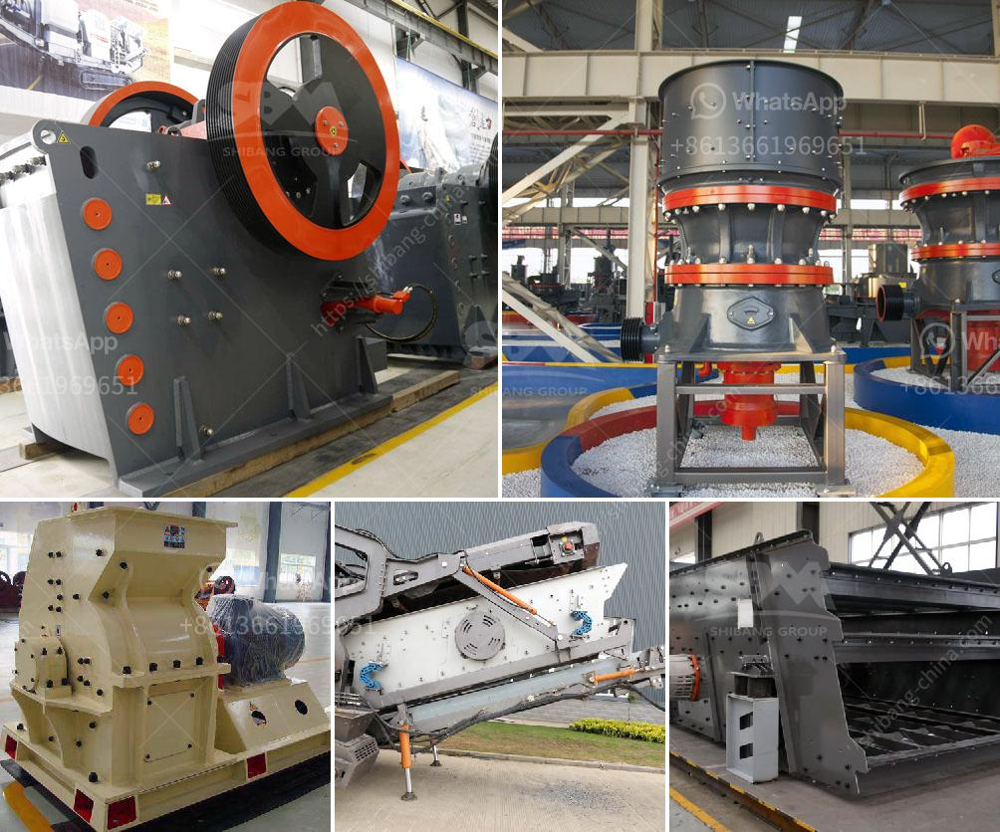

<h3>jaw crusher 200 tph parts details</h3>
The jaw crusher 200 tph parts details is a robust jaw crusher, suitable for a wide range of applications. It is capable of performing in tough and demanding environments. It has a fully fabricated and stress-relieved main frame, which ensures the durability and reliability of the equipment.

The jaw crusher 200 tph parts details is designed to crush hard stones and minerals. The jaw crusher 200 tph parts details can be adjusted to different sizes and capacities according to your requirements. The jaw crusher 200 tph parts details is equipped with a hydraulic toggle system that enables it to deliver quick and easy adjustments to the closed side setting.

The jaw crusher 200 tph parts details is built to deliver long-lasting performance. With more than 150 years of experience in designing and manufacturing jaw crushers, Metso Outotec has created a unique understanding of the needs of customers. The jaw crusher 200 tph parts details have been designed to ensure reliability in even the toughest quarrying or mining applications.

The jaw crusher 200 tph parts details are designed for seamless integration into a new or existing system. With numerous options available, customers can choose the jaw crusher 200 tph parts details that meets their specific needs. These options include a choice of jaw profiles, various jaw plate materials, and a range of sizes and capacities to suit different applications.

The jaw crusher 200 tph parts details can be customized to meet your specific requirements. Whether you need to maximize production, reduce wear costs, or improve environmental sustainability, the jaw crusher 200 tph parts details can help you achieve your goals. With a team of experts dedicated to providing innovative solutions, Metso Outotec can assist you in finding the ideal configuration for your operation.

The jaw crusher 200 tph parts details are designed to meet the demanding criteria set by contractors, mines, and quarry operators. These jaw crushers can handle everything from hard and abrasive rocks to soft and non-abrasive materials, such as limestone, granite, and basalt. They are also capable of recycling materials, such as construction and demolition waste, concrete, and asphalt.

In conclusion, the jaw crusher 200 tph parts details are designed to provide long-lasting performance in a wide range of applications. With its robust construction, high capacity, and customizable options, it is an ideal choice for any quarrying or mining operation. Whether you need to crush hard stones or recycle materials, the jaw crusher 200 tph parts details can meet your needs and exceed your expectations.
<h3>Contact us</h3><ul><li><strong>Whatsapp:&nbsp;<a href="https://wa.me/8613661969651">+8613661969651</a></strong></li><li><a href="https://swt.shibang-china.com/?git&amp;zhl&amp;jaw crusher 200 tph parts details"><strong>Online Service(chat now)</strong></a></li></ul><h3>Related</h3><ul><li><a href='stone crusher machine in south africa.md'>stone crusher machine in south africa</a></li><li><a href='coal mill manufacturers.md'>coal mill manufacturers</a></li><li><a href='best machine brands for quarry.md'>best machine brands for quarry</a></li><li><a href='ton day cement clinker grinding plant.md'>ton day cement clinker grinding plant</a></li><li><a href='bell finlay crusher prices.md'>bell finlay crusher prices</a></li></ul>