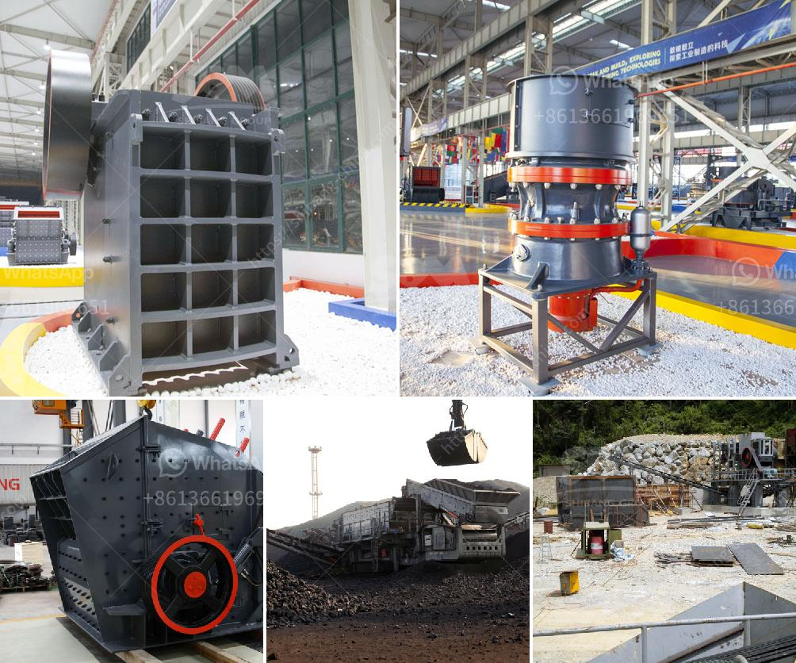

<h3>jaw crusher equipment alibaba</h3>
The jaw crusher equipment has gained traction in recent years for its wide range of applications and ability to process high volumes of material efficiently. As a result, jaw crushers have become a staple in the mining industry, where they are used to process ores and hazardous waste.

When it comes to purchasing jaw crusher equipment, Alibaba remains one of the most popular platforms for buyers and sellers alike. With the plethora of options available on the platform, it is essential to understand what to look for and how to navigate the extensive range of suppliers and products.

One of the key advantages of Alibaba is the ability to connect with various suppliers and access competitive pricing. Alibaba serves as a marketplace where buyers can browse through different products, compare specifications and prices, and ultimately select the most suitable jaw crusher equipment according to their specific needs.

When choosing a supplier on Alibaba, it's crucial to consider factors such as reputation, reviews, and transaction history. Suppliers with positive feedback and a high number of transactions are generally more reliable and trustworthy. Additionally, the supplier's response rate and the level of customer service they provide play a vital role in ensuring a smooth purchasing experience.

Alibaba offers a wide range of jaw crusher equipment options to cater to different requirements and budgets. It is important to understand the specifications and features of the equipment before making a purchase. Some essential considerations while evaluating the equipment include motor power, production capacity, feed size, and discharge size.

Motor power determines the crushing efficiency of the jaw crusher. Depending on the application and the desired output, buyers need to choose a jaw crusher with adequate power to handle the material effectively. The production capacity of the jaw crusher indicates how much material it can process per hour. It is crucial to select a jaw crusher that can handle the anticipated volume of material to ensure smooth operations.

Another critical consideration is the feed size and discharge size of the jaw crusher. The feed size determines the maximum size of the material that the crusher can handle, while the discharge size determines the final product size. Buyers must carefully evaluate their application requirements and choose a jaw crusher that satisfies their desired feed and discharge sizes.

Alibaba offers a range of jaw crusher equipment suitable for different industries and applications. Whether for mining, construction, or recycling purposes, buyers can find a jaw crusher that meets their specific needs. From small-scale portable jaw crushers to large-scale stationary crushers, Alibaba provides a diverse range of options to cater to various requirements.

Lastly, it is important to review the warranty and after-sales service offered by the supplier. A reliable warranty policy ensures that any defects or issues with the equipment are properly addressed by the supplier, protecting the buyer's investment.

In conclusion, when it comes to purchasing jaw crusher equipment, Alibaba offers a convenient platform to connect with reliable suppliers and access competitive pricing. Careful evaluation of the supplier's reputation, reviews, and transaction history, coupled with a thorough understanding of the equipment's specifications and features, ensures a successful purchase. Whether for mining, construction, or recycling purposes, Alibaba provides a wide range of jaw crusher equipment options suitable for various industries and applications.
<h3>Contact us</h3><ul><li><strong>Whatsapp:&nbsp;<a href="https://wa.me/8613661969651">+8613661969651</a></strong></li><li><a href="https://swt.shibang-china.com/?git&amp;zhl&amp;jaw crusher equipment alibaba"><strong>Online Service(chat now)</strong></a></li></ul><h3>Related</h3><ul><li><a href='kaolin crusher price.md'>kaolin crusher price</a></li><li><a href='coal washing plant for sale in south africa.md'>coal washing plant for sale in south africa</a></li><li><a href='almeida stone crusher.md'>almeida stone crusher</a></li><li><a href='hard stone aggregate crusher price.md'>hard stone aggregate crusher price</a></li><li><a href='distribuidores de equipo de trituracion extec.md'>distribuidores de equipo de trituracion extec</a></li></ul>