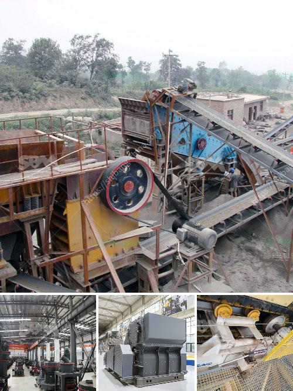

<h3>jaw crusher in uganda</h3>
The jaw crusher is a vital equipment in the mining and construction industry in Uganda. It is primarily used to break large stones into smaller pieces for the next crushing process. It has an impressive production capacity of up to 400-800 tons per hour.

One of the key features of the jaw crusher is its reliability. It is designed with advanced technology and high-quality materials, ensuring its durability and long service life. This makes it suitable for continuous operation, even in challenging environments. The robust construction of the jaw crusher enables it to withstand heavy-duty use, reducing the likelihood of breakdowns and downtime.

Another advantage of the jaw crusher is its versatility. It can be used for various applications, such as crushing different types of stones, including granite, marble, and limestone. Additionally, it can handle different sizes of stones, allowing for flexibility in the production process. The adjustable jaw design enables different output sizes, making it convenient for different end-user requirements.

The jaw crusher is also renowned for its efficiency. It uses a mechanical pressure to crush the stones, reducing energy consumption compared to other crushing equipment. The efficient crushing process results in higher productivity and lower operating costs. Additionally, it requires minimal maintenance, saving time and resources for operators.

Furthermore, the jaw crusher in Uganda is user-friendly, making it easy to operate and maintain. The control panel is designed with simple and intuitive buttons, allowing operators to adjust settings effortlessly. Routine maintenance tasks, such as changing of worn-out components, can be done quickly and easily.

In terms of safety, the jaw crusher is designed with modern safety features to ensure the protection of the operator. It is equipped with a hydraulic system that provides overload protection, preventing damage to the crusher or injury to the operator as a result of excessive load. Additionally, the jaw crusher is equipped with a safety lock device, which prevents accidental startup during maintenance or repair work.

In conclusion, the jaw crusher is a valuable asset in Uganda's mining and construction industry. Its reliability, versatility, efficiency, and user-friendly design make it an essential tool for crushing large stones into smaller pieces. With its impressive production capacity and low operating costs, the jaw crusher provides a cost-effective solution for various crushing applications.
<h3>Contact us</h3><ul><li><strong>Whatsapp:&nbsp;<a href="https://wa.me/8613661969651">+8613661969651</a></strong></li><li><a href="https://swt.shibang-china.com/?git&amp;zhl&amp;jaw crusher in uganda"><strong>Online Service(chat now)</strong></a></li></ul><h3>Related</h3><ul><li><a href='crushed stone products mwanza tanzania.md'>crushed stone products mwanza tanzania</a></li><li><a href='mini stone jaw crushers.md'>mini stone jaw crushers</a></li><li><a href='movable crushing plant.md'>movable crushing plant</a></li><li><a href='ball mill feed spout seal.md'>ball mill feed spout seal</a></li><li><a href='tonne an hour ball mill.md'>tonne an hour ball mill</a></li></ul>