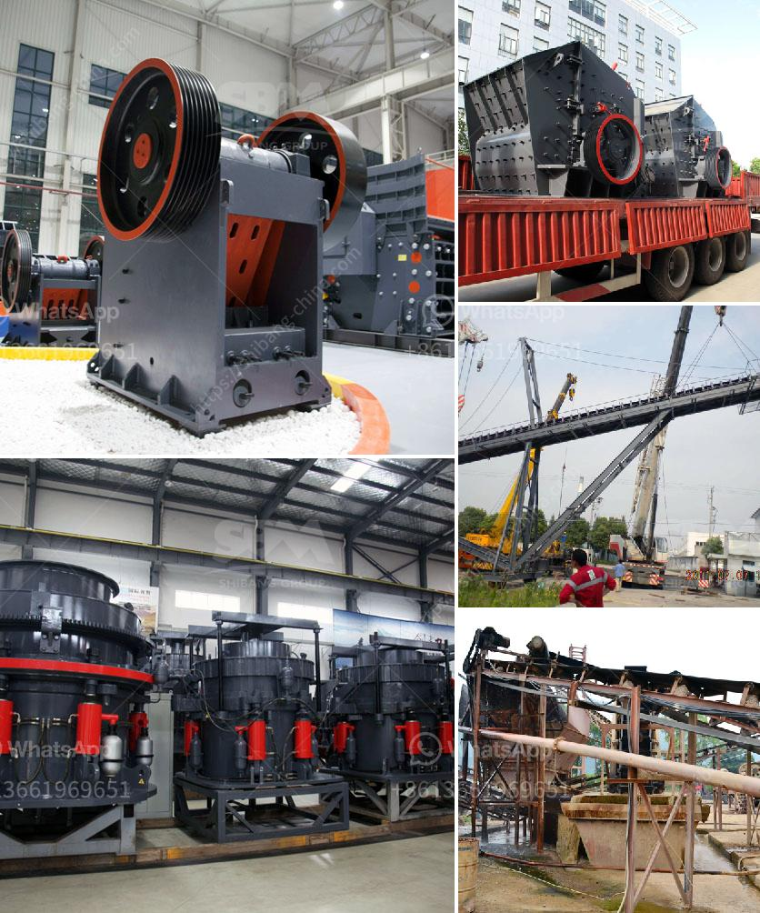

<h3>jaw crusher parameters</h3>
A jaw crusher is one of the main types of primary crushers in a mine or ore processing plant. The size of a jaw crusher is designated by the rectangular or square opening at the top of the jaws (feed opening). For instance, a 24 x 36 jaw crusher has a opening of 24" by 36", a 56 x 56 jaw crusher has a opening of 56" square. Jaw crusher parameters define the structure and capacity of the crusher, as well as the energy consumption.

Jaw crushers are widely used in the mining and construction industry due to their ability to crush hard materials efficiently. Jaw crushers are generally classified as primary crushers, which break large, bulky materials into smaller pieces, and secondary crushers, which further reduce the size of the material to produce the desired end product.

When choosing a jaw crusher, it's important to consider several parameters that will affect the performance of the crusher and the overall production capacity. Some of the key parameters include:

1. Feed Size: The size of the material to be crushed determines the size of the jaw crusher required. The feed size should be such that it allows for easy feeding into the crusher, without causing any blockages.

2. Capacity: The capacity of the jaw crusher is directly related to its size. Larger crushers have higher capacity as they can crush more material in a single cycle. However, larger crushers also consume more energy and are more expensive to operate.

3. Power Consumption: The power consumption of a jaw crusher depends on the size and type of the crusher, as well as the hardness of the material being crushed. Higher power consumption indicates a higher crushing force requirement, which may result in increased wear and tear on the crusher components.

4. Crushing Ratio: The crushing ratio is the ratio of the size of the feed material to the size of the crushed product. It indicates the degree of reduction achieved by the crusher. Higher crushing ratios result in finer end products, but also require higher power consumption.

5. Particle Shape: The shape of the particles produced by the crusher is an important parameter, especially for certain applications such as concrete production. A high-quality jaw crusher will produce cubic-shaped particles, which are desirable for optimal concrete strength.

6. Maintenance: The ease of maintenance and accessibility to key components of the jaw crusher should be considered. A well-designed crusher will have easy access to the crushing chamber, reducing downtime and facilitating maintenance tasks.

7. Safety: Safety features such as protective guards, emergency stop buttons, and safety locks should be present in a jaw crusher to protect the operator and prevent accidents.

In conclusion, selecting the right jaw crusher parameters is crucial for optimizing the overall performance and productivity of the crusher. Feed size, capacity, power consumption, crushing ratio, particle shape, maintenance, and safety should all be considered when choosing a jaw crusher. By understanding these parameters, operators can enhance their ability to produce high-quality end products while minimizing downtime and maintenance costs.
<h3>Contact us</h3><ul><li><strong>Whatsapp:&nbsp;<a href="https://wa.me/8613661969651">+8613661969651</a></strong></li><li><a href="https://swt.shibang-china.com/?git&amp;zhl&amp;jaw crusher parameters"><strong>Online Service(chat now)</strong></a></li></ul><h3>Related</h3><ul><li><a href='granite quarry machinery from turkey.md'>granite quarry machinery from turkey</a></li><li><a href='how much does a stone crusher mill.md'>how much does a stone crusher mill</a></li><li><a href='coal mill manufacturers.md'>coal mill manufacturers</a></li><li><a href='chrome mining business plan crusher.md'>chrome mining business plan crusher</a></li><li><a href='equipo del molino de bolas 750 hp precio del motor.md'>equipo del molino de bolas 750 hp precio del motor</a></li></ul>