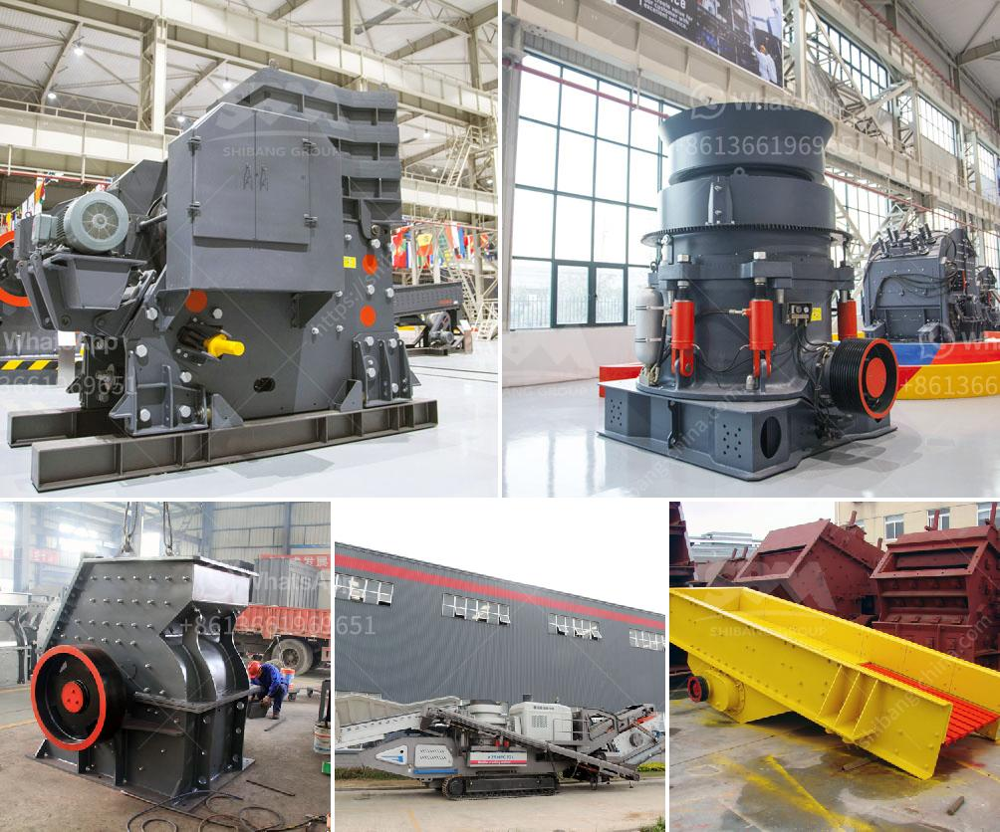

<h3>jaw crusher price in china</h3>
Jaw crusher is a common crushing machine in the mining industry. As one of the best selling stone crushers, it has been exported to over 90 countries such as Indonesia, Malaysia, Kenya, Tanzania, Ethiopia, Nigeria, South Africa, Egypt, etc. It has win the favor of the customers due to its reliable performance and competitive price. 

A jaw crusher is used for the primary crushing process in the stones and rocks crushing production line. Jaw crusher is typically used as the primary crusher for limestone, granite, marble, basalt, iron ore, copper ore, coal, slag and other materials. It is commonly used in the mining, metallurgy, building materials, highway, railway, water conservancy and chemical industries. 

With China's rapid economic development, there are many industries that need crushers. In order to promote the investment in these industries, the Chinese government has been supporting the development of the crusher industry. Therefore, the price of jaw crushers has been gradually declining over the past few years. Jaw crusher price in China is the concern for a lot of customers. We can provide the reasonable price according to the specific situation in production field. Price is important, but we can't ignore the machines' quality. Shanghai SBM will provide the excellent jaw crusher and reasonable price. Models of Jaw Crusher . SBM has developed well-known jaw crusher. It has exquisite design, high reduction ratio, high productivity, and eco-friendly processing technology. It is ideal for primary and secondary crushing. Jaw Crusher is always used with Cone Crusher, Impact Crusher and Sand Maker to constitute the sandstone production line. 

Jaw crusher can be divided into PE series and PEX series, of which the PE jaw crusher is used for coarse crushing, and PEX jaw crusher for medium and fine crushing. Jaw crusher has the advantages of high crushing ratio, good quality of finished products, reliable performance, convenient maintenance and low operation cost. It is widely used in mining, metallurgy, construction, highway, railway, irrigation and chemical industries, and our jaw crusher price is reasonable and favorable. 

The jaw crusher provided by Shanghai SBM has many advantages, such as convenient maintenance, low maintenance cost, advanced crushing principle and technical parameters, reliable operation and low operating cost. It is widely used in mining, metallurgy, construction, highway, railway, water conservancy, chemical industry and other industries. 

As for the price of jaw crusher, different manufacturers and different types of machines will have their own pricing standards. Jaw crusher price is also affected by the market demand and other factors. The price of jaw crusher in China has always been a topic of concern for customers. As a professional manufacturer of mining equipment, SBM has improved the jaw crusher's price and performance. It has high crush efficiency and low energy consumption. In addition, SBM always tries its best to protect the environment through innovative design and advanced technology. 

Overall, jaw crusher is more cost-effective than other crushers because it avoids repeated crushing of the same material. Therefore, jaw crusher is firmly favored by mining companies. As a professional manufacturer of mining equipment, SBM insists on providing customers with high-quality equipment and efficient service. Jaw crusher is one of them. In addition, to our jaw crusher price, we also offer various crushing machines and grinding mills at a reasonable price. 

In conclusion, the price of jaw crusher in China has been in fluctuation. It is mainly affected by the following factors: market demand, environmental protection policy, technology and manufacturing process, and manufacturers' competition. And the jaw crusher price in China is relatively affordable. Whether you want to invest in a small jaw crusher or a big one, there are great benefits to choose SBM. We promise that we will provide the best service and products for our customers.
<h3>Contact us</h3><ul><li><strong>Whatsapp:&nbsp;<a href="https://wa.me/8613661969651">+8613661969651</a></strong></li><li><a href="https://swt.shibang-china.com/?git&amp;zhl&amp;jaw crusher price in china"><strong>Online Service(chat now)</strong></a></li></ul><h3>Related</h3><ul><li><a href='jual ball mill second.md'>jual ball mill second</a></li><li><a href='design calculations of rotary dryer.md'>design calculations of rotary dryer</a></li><li><a href='used vsi crusher for sale in india.md'>used vsi crusher for sale in india</a></li><li><a href='iron ore crusher for sale.md'>iron ore crusher for sale</a></li><li><a href='how much a stone crusher cost.md'>how much a stone crusher cost</a></li></ul>