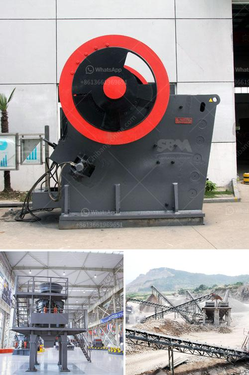

<h3>jaw crusher price suppliers</h3>
Jaw crusher is a common industrial crushing machine used for primary crushing of large and medium-sized ore and stone materials. It is widely used in mining, smelting, building materials, highways, railways, water conservancy, chemical industry and other industries. As a professional jaw crusher supplier, Aimix jaw crusher machine for sale totally can be your best choice if you wan to buy jaw crusher.

jaw crusher machine production capacity depends on the feed size and the volume of the silo, bin and belt conveyor. In general, the maximum feed size small jaw crusher machine is 400 * 600mm, and the maximum feed size large jaw crusher machine is 1500 * 900mm.

The production capacity of small jaw crusher is within 1-20t/h, and the production capacity of large jaw crusher is within 300-1000t/h.

Therefore, the configuration of jaw crusher machine is mainly according to the stone production line. Most people use cone crusher machine instead of jaw crusher machine for its high production capacity.

However, for the majority of factory owners, both jaw crusher machine and cone crusher machine are necessary. Here, I will introduce some of the jaw crusher price suppliers to you.

Alibaba is China's largest online B2B marketplace, which connects manufacturers, suppliers and buyers worldwide. Being the leading jaw crusher price supplier, Alibaba provides a wide range of jaw crushers for sale, including PE jaw crusher, PEX jaw crusher and HD series jaw crusher.

Some well-known brand jaw crusher manufacturers have their own websites, where you can find detailed information about different types of jaw crushers. These manufacturers typically have high-quality products and may offer competitive prices.

If you prefer buying products from local suppliers, you can visit local industrial exhibitions or contact local wholesalers. Local suppliers may have better knowledge about the market and can provide tailored solutions based on your specific requirements.

In summary, when purchasing a jaw crusher, it is essential to consider various factors, such as production capacity, size of the feed material, and your budget. Going through available online platforms, contacting well-known brands, and exploring local suppliers can help you find the best jaw crusher price supplier that meets your needs.
<h3>Contact us</h3><ul><li><strong>Whatsapp:&nbsp;<a href="https://wa.me/8613661969651">+8613661969651</a></strong></li><li><a href="https://swt.shibang-china.com/?git&amp;zhl&amp;jaw crusher price suppliers"><strong>Online Service(chat now)</strong></a></li></ul><h3>Related</h3><ul><li><a href='stone crusher machine for hire in mpumalanga.md'>stone crusher machine for hire in mpumalanga</a></li><li><a href='graphite powder machine.md'>graphite powder machine</a></li><li><a href='business plan for aggregates production plant pdf.md'>business plan for aggregates production plant pdf</a></li><li><a href='crusher plant for sale in south africa.md'>crusher plant for sale in south africa</a></li><li><a href='gold wash plant for sale canada.md'>gold wash plant for sale canada</a></li></ul>