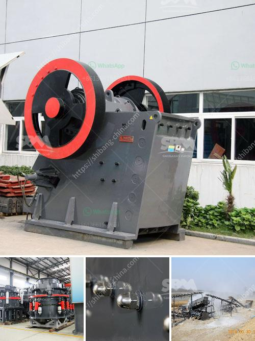

<h3>jaw crusher shaft parts diagram</h3>
A jaw crusher is a primary crushing machine that is used for crushing different hard materials such as rocks and ores. It is widely used in the industry sector for its efficiency and low maintenance. However, a jaw crusher’s shaft parts, consisting of the movable jaw, pitman, toggle plates, and the eccentric shaft is subject to enormous stress. This article analyzes the shaft parts diagram and its working principles.

The movable jaw, also known as the swing jaw, is the main part of the jaw crusher. It is made up of two panels that are tightly secured to the frame. The jaws are further supported by a shaft located at the top and an eccentric motion that drives the moving jaw. This ensures the smooth movement of the jaw, facilitating the crushing process.

The pitman, or crank arm, is the connecting rod of the jaw crusher. It transfers the cyclic motion of the eccentric shaft into the linear motion of the swinging jaw. The motion of the pitman is important for the efficient crushing of the material. It acts as a lever, amplifying the force applied to the material and enabling the jaws to exert more pressure, resulting in better crushing efficiency.

The toggle plates are positioned between the pitman and the moving jaw. They function as a safety mechanism to prevent overload and damage to the crusher. When an uncrushable material enters the crushing chamber, the toggle plates detach and release the tension, allowing the moving jaw to move backwards and protect the crusher from ensuing damage. Once the uncrushable material is cleared, the toggle plates return to their original position, and the crushing operation resumes.

The eccentric shaft is a crucial component of the jaw crusher. It is responsible for the rotation of the swinging jaw. The eccentric shaft is made of high-grade forged steel and is designed to withstand high levels of torque. The shaft is mounted on two robust bearings, known as the pitman bearings, which support the eccentric motion of the jaw.

In conclusion, the shaft parts of a jaw crusher play a crucial role in its functioning. The movable jaw, pitman, toggle plates, and eccentric shaft work together to provide reliable crushing efficiency. It is essential to properly inspect and maintain these parts to ensure their optimal performance and prolong the lifespan of the crusher. Regular lubrication and timely replacement of worn-out components are necessary steps to prevent premature wear and tear. Adequate maintenance practices will help ensure smooth operation, reduce downtime, and maximize productivity.
<h3>Contact us</h3><ul><li><strong>Whatsapp:&nbsp;<a href="https://wa.me/8613661969651">+8613661969651</a></strong></li><li><a href="https://swt.shibang-china.com/?git&amp;zhl&amp;jaw crusher shaft parts diagram"><strong>Online Service(chat now)</strong></a></li></ul><h3>Related</h3><ul><li><a href='stone crusher machine factory in china.md'>stone crusher machine factory in china</a></li><li><a href='ball mill plant manufacturers.md'>ball mill plant manufacturers</a></li><li><a href='basalt manufacturer crusher machine.md'>basalt manufacturer crusher machine</a></li><li><a href='price for cone crusher.md'>price for cone crusher</a></li><li><a href='crusher manufacturers prices.md'>crusher manufacturers prices</a></li></ul>