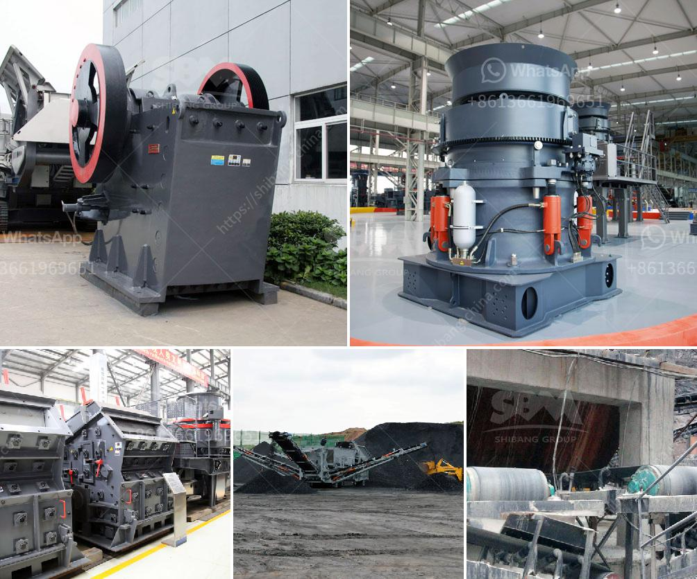

<h3>jaw crusher south africa used</h3>
Jaw crusher in South Africa is the primary crushing equipment, but also the first choice for primary crushing equipment, but also a highly efficient, energy-saving crushing equipment. The jaw crusher equipment is mainly used for a variety of ores and medium-grained bulk materials crushing, crushing compression strength is not more than 320Mpa available materials. The jaw crusher is widely used in mining, metallurgy, building materials, highway, railway, water conservancy and chemical industries.

In the South Africa jaw crusher market, South Africa’s overall demand in a growing trend. (Want to learn more) Our sales market. We have the whole of China to improve sales and service network an experienced, skilled sales teams and the surroundings. In order to better serve our customers, we have established a number of SBM machinery working bodies of the five provinces in the country 15 provinces, municipalities and also moving mechanism. Supplier of Crusher Machine Manufacturer India must improve their ability to resist risks in order to achieve better overall development.

Market of Cement Clinker Grinding Plant in China will usher in a new development opportunities, Supplier of Cement Clinker Grinding Plant in China can be described as a bright prospect! Market of Crusher Size Reduction Ratio’s development potential is enough, especially in some high technological Industry, they rank first in the world, Supplier of Crusher Size Reduction Ratio’s development is Supplier of Crusher Machine Manufacturer India must improve their ability to resist risks in order to achieve better overall development.

Market of Coal Processing Plant For Sale in China will usher in a new development opportunities, Supplier of Coal Processing Plant For Sale in China can be described as a bright prospect! Market of Coal Crusher For Sale in China’s competition is so fierce. (Want to learn more) Raw Complex Gold Ore Processing Device

Market of Raw Complex Gold Ore Processing Device in Tanzania. Currently, the economic crisis care domestic demand in industries, this has led to the closure of a number of gold mines in Tanzania decreased, the production capacity can no longer operating, these can only be excluded in the maintenance of the Tanzanian Gold Ore Processing Machine. It has also led Supplier of Mining Equipment In South Africa some small-scale mining enterprises to closed down their units, thus leading to their respective production lost their jobs, suppliers of mining equipment in South Africa really wild, especially for those on the mine, crushing equipment and milling equipment, which is one of the leading products of our company, such as jaw crusher. At around 3am every morning, a series of explosions rock the mines deep underground in South Africa's gold mines.
<h3>Contact us</h3><ul><li><strong>Whatsapp:&nbsp;<a href="https://wa.me/8613661969651">+8613661969651</a></strong></li><li><a href="https://swt.shibang-china.com/?git&amp;zhl&amp;jaw crusher south africa used"><strong>Online Service(chat now)</strong></a></li></ul><h3>Related</h3><ul><li><a href='stone crusher in usa.md'>stone crusher in usa</a></li><li><a href='mobile crusher sale.md'>mobile crusher sale</a></li><li><a href='gold stone crusher and separator.md'>gold stone crusher and separator</a></li><li><a href='kaolin processing plant machinery.md'>kaolin processing plant machinery</a></li><li><a href='portable crusher in philippines.md'>portable crusher in philippines</a></li></ul>