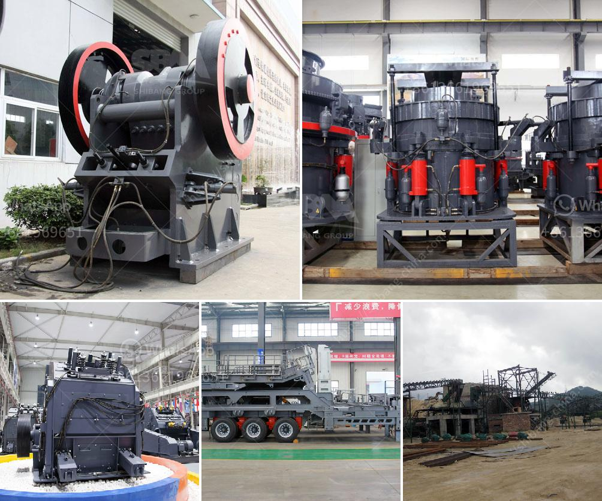

<h3>jaw crusher specification for lime limestone</h3>
A jaw crusher is widely used in the lime limestone production line for breaking large stones into desired sizes. Lime limestone is a versatile rock that holds immense applications in construction and landscaping projects. Therefore, using a reliable and durable jaw crusher is paramount to its success.

1. Capacity and throughput: The desired processing capacity and product size are important considerations while selecting a jaw crusher. A higher capacity enables more efficient crushing, especially for larger quantities of lime limestone.

2. Feed size: Lime limestone comes in various sizes, and the jaw crusher should be able to accommodate the maximum feed size of the material. If the lime limestone is too large for the machine to handle, it will lead to uneven and inefficient crushing.

3. Power requirements: A jaw crusher operates on electricity, so the power requirements for the machine should be within the local electrical capacity. Inadequate power supply can hamper the functionality and output of the jaw crusher.

4. Wear parts and maintenance: Jaw crushers endure massive strain due to the continuous crushing of lime limestone. Therefore, choosing a jaw crusher with durable wear parts and easy maintenance is essential for optimal performance and longevity.

5. Safety features: Safety should be a top priority when operating any heavy machinery. A jaw crusher with adequate safety features, such as emergency stop buttons, protective guards, and lockout/tag-out capabilities, will ensure operator safety during routine operations and maintenance.

When selecting a jaw crusher for lime limestone, it is advisable to consult with industry experts or manufacturers to determine the most suitable machine for your specific requirements. They can provide guidance on the appropriate model, capacity, and other specifications.

In conclusion, a jaw crusher with optimal specifications for lime limestone crushing is crucial for the success of the lime limestone production line. The chosen jaw crusher should be durable enough to withstand heavy environmental and operational conditions. By considering factors such as capacity, feed size, power requirements, wear parts, maintenance, and safety features, one can select a jaw crusher that ensures efficient and safe crushing operations.
<h3>Contact us</h3><ul><li><strong>Whatsapp:&nbsp;<a href="https://wa.me/8613661969651">+8613661969651</a></strong></li><li><a href="https://swt.shibang-china.com/?git&amp;zhl&amp;jaw crusher specification for lime limestone"><strong>Online Service(chat now)</strong></a></li></ul><h3>Related</h3><ul><li><a href='powder crushing machine making.md'>powder crushing machine making</a></li><li><a href='belt conveyor continental di indonesia.md'>belt conveyor continental di indonesia</a></li><li><a href='cement production plant.md'>cement production plant</a></li><li><a href='ball mill manufacturer in bhayander.md'>ball mill manufacturer in bhayander</a></li><li><a href='bauxite plant in dubai.md'>bauxite plant in dubai</a></li></ul>