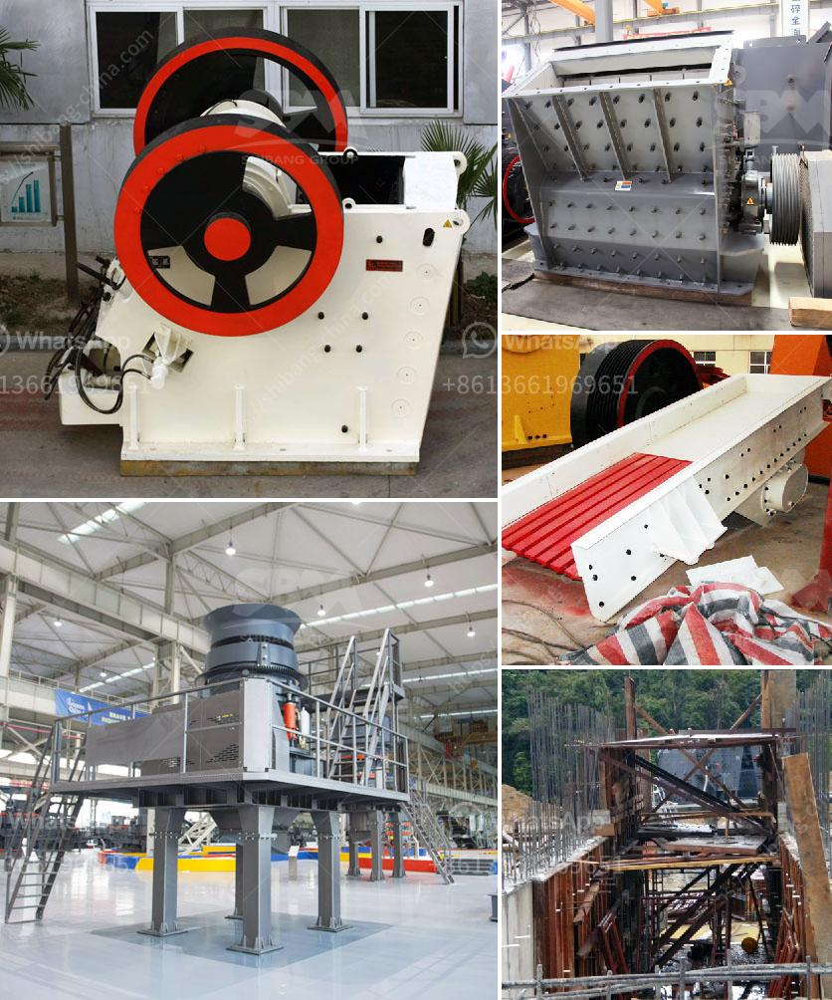

<h3>jaw crusher supplier</h3>
When it comes to crushing and grinding equipment, the importance of jaw crushers is undeniable. These machines are specifically designed to reduce the size of large rocks and break them down into smaller particles for further processing. However, selecting the right jaw crusher supplier is key to ensuring the success of any crushing plant.

One of the first factors to consider when choosing a jaw crusher supplier is the quality of the products they offer. A good supplier will manufacture durable and reliable crushers that withstand heavy-duty use and are built to last. High-quality materials, such as manganese steel, are often used for the construction of crushing jaws, ensuring maximum durability and strength.

Moreover, reputable suppliers conduct comprehensive quality control checks throughout the manufacturing process to guarantee that each unit performs optimally. This not only guarantees the longevity of the jaw crusher but also ensures that it operates efficiently, reducing downtime and maximizing productivity.

A reliable jaw crusher supplier should possess technological expertise in the design and engineering of crushing equipment. They should be able to provide comprehensive technical support, including guidance on the proper selection of crushers based on specific requirements, installation assistance, and ongoing maintenance services.

The supplier's team of engineers and experts should be well-versed in various crushing applications and have a deep understanding of the industry's standards and regulations. Their expertise will contribute to the successful operation and optimization of the crushing system.

Checking customer reviews and seeking references from existing customers is an essential step when evaluating a jaw crusher supplier. Reading reviews from those who have already purchased and used the equipment will provide valuable insights into the supplier's track record, customer satisfaction, and after-sales support.

Additionally, connecting with other industry professionals or seeking recommendations from trusted sources can help confirm the supplier's reputation and reliability.

Opting for a jaw crusher supplier that offers comprehensive after-sales support is crucial. Crushers are complex machines that require regular maintenance, parts replacements, and technical assistance. A reliable supplier should have a well-established after-sales service network that guarantees prompt response and assistance.

Availability of spare parts and a quick turnaround time for replacement requests are vital factors to consider. Additionally, some suppliers may offer training programs for operation and maintenance, ensuring that the customer's team can efficiently operate and care for the equipment.

Selecting the right jaw crusher supplier for your crushing needs is an important decision. Considering factors such as quality products, technical expertise, customer reviews, and after-sales support will help you make an informed choice.

Investing in a reputable supplier with a track record of delivering high-quality, reliable, and efficient jaw crushers will ensure that your crushing operations remain productive and profitable.
<h3>Contact us</h3><ul><li><strong>Whatsapp:&nbsp;<a href="https://wa.me/8613661969651">+8613661969651</a></strong></li><li><a href="https://swt.shibang-china.com/?git&amp;zhl&amp;jaw crusher supplier"><strong>Online Service(chat now)</strong></a></li></ul><h3>Related</h3><ul><li><a href='list of machinery used in the quarry.md'>list of machinery used in the quarry</a></li><li><a href='price of central vertical roller mill.md'>price of central vertical roller mill</a></li><li><a href='gold stamp mill for sale in china.md'>gold stamp mill for sale in china</a></li><li><a href='10 tpd grindig mill manufacturers philippines.md'>10 tpd grindig mill manufacturers philippines</a></li><li><a href='stone crushing process.md'>stone crushing process</a></li></ul>