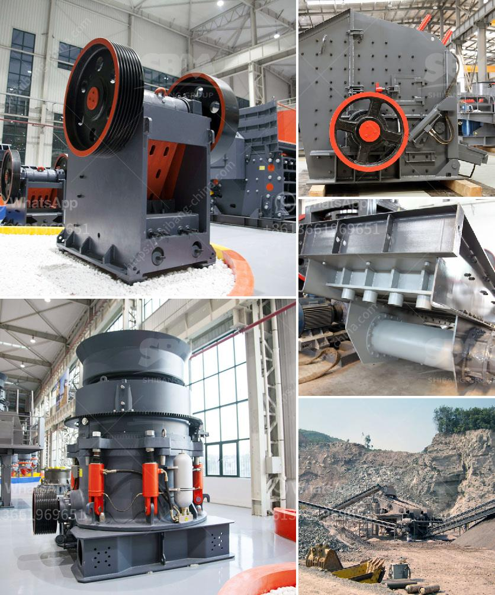

<h3>jaw crusher what price in china</h3>
The jaw crusher is an essential piece of equipment in many industries, including mining, construction, and demolition recycling. It plays a crucial role in crushing a variety of materials to help produce quality aggregates for further use. With the rapid development of China's economy and infrastructure, the demand for jaw crushers has been increasing. But what is the price of jaw crusher in China?

There are several factors that determine the price of a jaw crusher in China. First, it is important to consider the capacity, material properties, and discharge size of the machine. Higher capacity models are generally more expensive due to their increased production capabilities. Additionally, a jaw crusher designed to handle different types of materials, such as granite or limestone, may come at a higher cost.

The brand and quality of the jaw crusher also affect its price. China has a wide range of jaw crusher manufacturers, and it is not surprising that the prices vary greatly. You can easily find a jaw crusher with high quality and reasonable price based on its brand and reputation.

Another factor that influences the price is the supply and demand situation in the market. When the demand for jaw crushers exceeds the supply, the prices tend to increase. Conversely, when the supply surpasses the demand, the prices may decrease. Economic indicators, trade policies, and government regulations can affect the supply and demand dynamics, thus impacting the pricing of jaw crushers.

Moreover, the cost of production and labor also contributes to the price of a jaw crusher in China. Manufacturers need to consider various expenses, such as raw materials, machinery maintenance, and employee wages, when setting the price. Additionally, the level of automation and technology utilized in the production process can influence the cost, which in turn affects the final price of the jaw crusher.

It is worth mentioning that the after-sales service provided by the manufacturer can play a role in determining the price. A reliable and responsive after-sales service helps build trust with customers and adds value to the overall product. Manufacturers who invest in customer support and offer warranty coverage may charge a slightly higher price for their jaw crushers.

When looking to purchase a jaw crusher in China, it is essential to consider the factors mentioned above in order to make an informed decision. Assessing your specific requirements regarding capacity, materials, and discharge size can help you determine the appropriate price range for your needs. Researching different brands, comparing prices, and reading customer reviews are also recommended to ensure you get the best value for your investment.

In conclusion, the price of a jaw crusher in China can vary depending on various factors such as capacity, material properties, brand reputation, supply and demand, production costs, and after-sales service. By carefully considering these factors and conducting thorough research, buyers can find a jaw crusher that meets their requirements at a reasonable price.
<h3>Contact us</h3><ul><li><strong>Whatsapp:&nbsp;<a href="https://wa.me/8613661969651">+8613661969651</a></strong></li><li><a href="https://swt.shibang-china.com/?git&amp;zhl&amp;jaw crusher what price in china"><strong>Online Service(chat now)</strong></a></li></ul><h3>Related</h3><ul><li><a href='enquiry about cone crusher.md'>enquiry about cone crusher</a></li><li><a href='stone crusher dubai.md'>stone crusher dubai</a></li><li><a href='marble production process.md'>marble production process</a></li><li><a href='quartz stone 30 80 plant process.md'>quartz stone 30 80 plant process</a></li><li><a href='aggregate crushing plant for sale.md'>aggregate crushing plant for sale</a></li></ul>