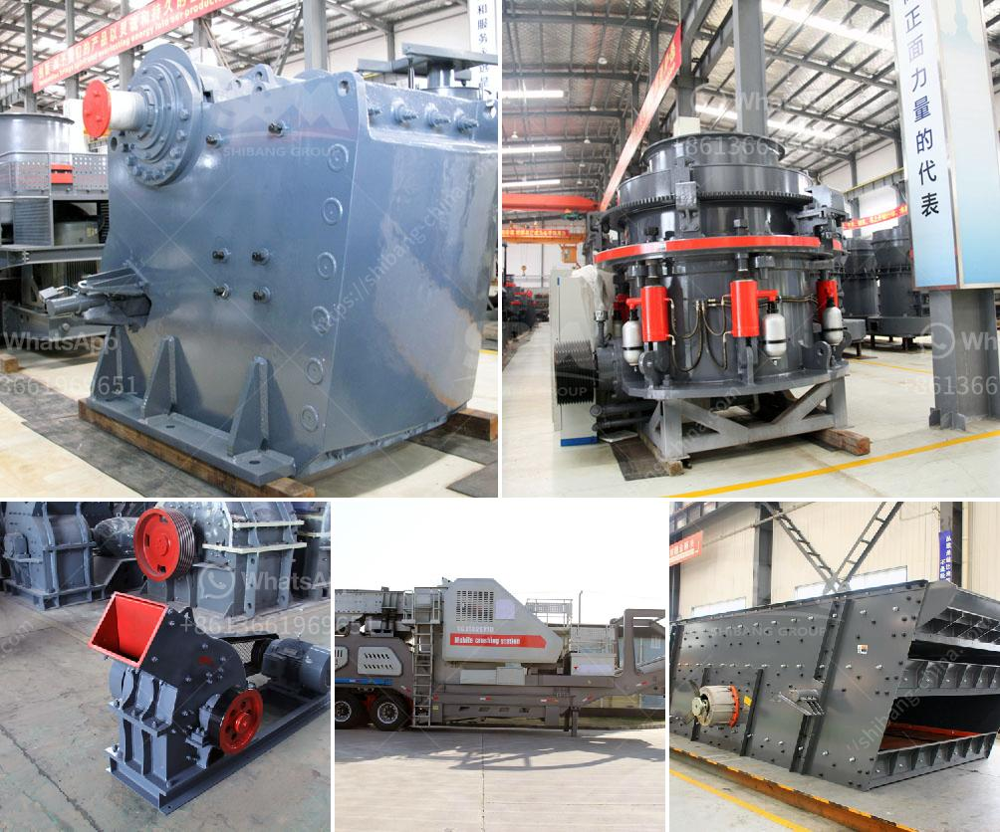

<h3>jaw crushers liners</h3>
Jaw crushers are widely used in the mining and construction industry due to their ability to crush large materials into smaller pieces. These machines have a stationary jaw and a moving jaw, with the former acting as a fixed base where the latter exerts force for crushing the material. To ensure effective and efficient crushing operations, the liners used in jaw crushers play a crucial role.

Liners, also known as jaw plates, are parts of the crusher that directly contact and crush the material. They are made of various materials such as manganese steel, high chromium cast iron, or composite materials depending on the type of crushing application. The primary function of liners is to protect the jaw crusher's mainframe from wear and tear caused by the constant friction between the moving jaw and the crushed material.

The selection of the appropriate liners is essential to maximize the productivity and lifespan of a jaw crusher. The choice of liner material depends on factors such as the hardness of the material being crushed, the abrasiveness of the material, and the desired final product size. Different materials offer varying levels of wear resistance and toughness, which are vital for withstanding the high impact and abrasive forces involved in the crushing process.

Manganese steel liners are the most commonly used type due to their excellent wear resistance. They are known for their ability to withstand heavy impact and high compression forces, making them suitable for crushing hard and abrasive materials. However, manganese steel liners can be susceptible to work-hardening, leading to reduced wear resistance over time. To mitigate this, some manufacturers produce liners with a higher manganese content, or incorporate additional elements such as chromium or molybdenum for increased hardness and wear resistance.

High chromium cast iron liners are another popular choice for jaw crushers, particularly when crushing materials with high abrasive properties. These liners have a martensitic matrix structure that provides excellent wear resistance and toughness. The presence of hard carbides dispersed throughout the matrix enhances their ability to withstand impact forces. However, high chromium cast iron liners can be brittle and prone to breakage under severe impact conditions, limiting their applicability in certain crushing environments.

Composite materials, such as ceramics or epoxy-based composites, are also being increasingly utilized as liner materials. These materials offer exceptional wear resistance and can handle highly abrasive materials. With their light weight and excellent durability, they can enhance the crushing process by reducing the overall weight of the liners, resulting in higher throughput and energy efficiency. Composite liners are particularly suitable for applications that involve crushing ores containing high levels of silica, as they reduce the risk of silica dust generation during the crushing process.

In conclusion, jaw crusher liners are crucial components in the crushing process. The selection of the appropriate liner material is crucial for optimizing crusher performance and minimizing downtime. The choice of liner material depends on various factors, including the material's hardness and abrasiveness, as well as the desired final product size. Manufacturers continue to improve liner designs and materials to enhance wear resistance, toughness, and overall crusher performance. By selecting and maintaining the right liners, operators can ensure efficient crushing operations and prolong the lifespan of their jaw crushers.
<h3>Contact us</h3><ul><li><strong>Whatsapp:&nbsp;<a href="https://wa.me/8613661969651">+8613661969651</a></strong></li><li><a href="https://swt.shibang-china.com/?git&amp;zhl&amp;jaw crushers liners"><strong>Online Service(chat now)</strong></a></li></ul><h3>Related</h3><ul><li><a href='crushing stones for gold.md'>crushing stones for gold</a></li><li><a href='vertical roller mill suppliers.md'>vertical roller mill suppliers</a></li><li><a href='total gypsum mill production in india.md'>total gypsum mill production in india</a></li><li><a href='mineral that is used to make talcum powder.md'>mineral that is used to make talcum powder</a></li><li><a href='ball mill manufacturer in bhayander.md'>ball mill manufacturer in bhayander</a></li></ul>