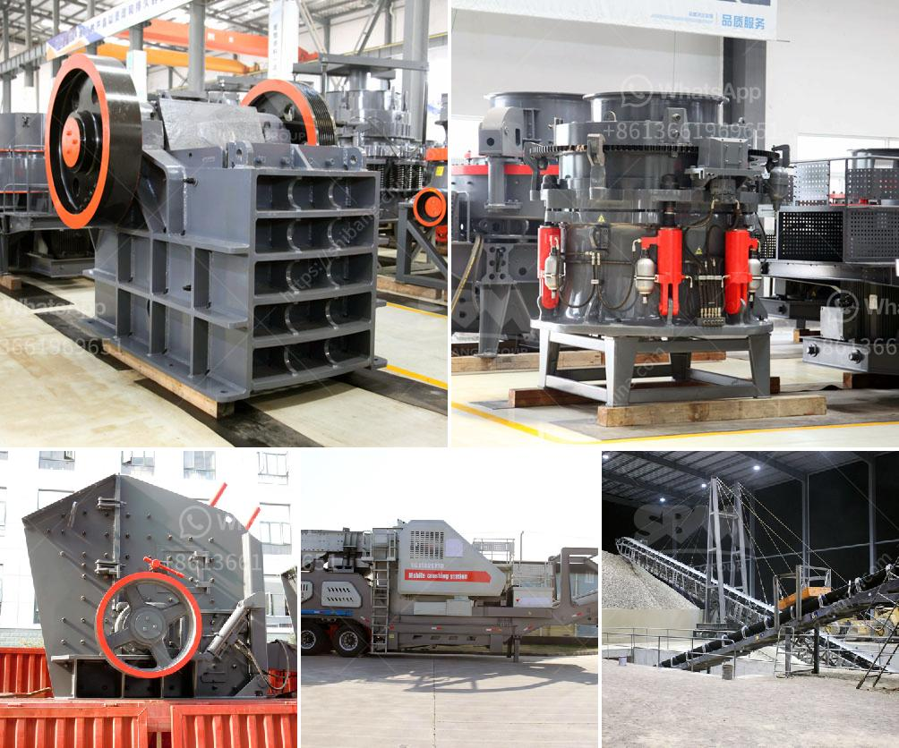

<h3>jaw crushers price</h3>
Jaw crushers are used in various industries such as mining, construction, demolition, and recycling. They are commonly used to crush large rocks into smaller sizes for further processing. These machines have gained widespread popularity due to their high efficiency and reliability. However, when it comes to purchasing a jaw crusher, many people often wonder about the price tag associated with it. In this article, we will explore the factors that determine the price of jaw crushers and provide some insights into the average cost range in the market.

The price of a jaw crusher depends on various factors, including the capacity, materials processed, and the brand reputation. The capacity of a jaw crusher is determined by its size and the type of material it can crush. Generally, jaw crushers with larger feed openings and higher capacities tend to be more expensive. These crushers are ideal for crushing large rocks and are commonly used in mining applications where high throughput is required.

The materials processed by a jaw crusher also influence its price. Jaw crushers are capable of handling different types of materials, including hard and soft rocks, and even abrasive materials. If you need a jaw crusher that can handle tough materials, such as granite or basalt, you may have to pay more compared to a crusher designed for softer materials like limestone or sandstone.

Another important factor to consider when evaluating jaw crusher prices is the brand reputation. Established brands with a long history of producing reliable and durable crushers tend to be more expensive than relatively new or unknown brands. While opting for a reputable brand may come at a higher cost, it can provide you with peace of mind knowing that you are investing in a high-quality product that will last for a long time.

On average, jaw crushers can range in price from a few thousand dollars to tens of thousands of dollars. However, it is essential to note that these figures are just estimates and can vary significantly depending on the factors mentioned earlier. To determine the exact price, it is best to contact different suppliers and manufacturers, provide them with your specific requirements, and request a quote.

Aside from the initial purchase price, there are other costs to consider when buying a jaw crusher. These can include installation, maintenance, and replacement parts. It is crucial to factor in these costs to get a comprehensive understanding of the overall investment required.

In conclusion, jaw crushers are powerful machines that are widely used in various industries. The price of a jaw crusher can vary depending on factors such as capacity, materials processed, and brand reputation. It is important to carefully evaluate your specific requirements and consider the long-term costs associated with owning a jaw crusher. By doing so, you can make an informed decision and choose the right crusher that meets your needs and budget.
<h3>Contact us</h3><ul><li><strong>Whatsapp:&nbsp;<a href="https://wa.me/8613661969651">+8613661969651</a></strong></li><li><a href="https://swt.shibang-china.com/?git&amp;zhl&amp;jaw crushers price"><strong>Online Service(chat now)</strong></a></li></ul><h3>Related</h3><ul><li><a href='screw conveyor design calculation.md'>screw conveyor design calculation</a></li><li><a href='china quartz sand dryer manufacturer.md'>china quartz sand dryer manufacturer</a></li><li><a href='ballast crusher price.md'>ballast crusher price</a></li><li><a href='vibrating screens usa.md'>vibrating screens usa</a></li><li><a href='gypsum powder production line manufacturers germany.md'>gypsum powder production line manufacturers germany</a></li></ul>